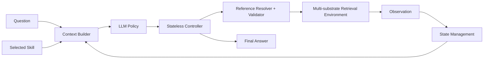

# Agentic RAG

A single-agent, multi-substrate retrieval system for 2WikiMultiHopQA,
HotpotQA, Medical and Novel from GraphRAG-Bench, and MuSiQue. The repository
contains one production architecture: Semantic Memory, episode-local typed
references, centralized State Management, and a stateless Controller.



## Design

The Policy sees the question, neutral action protocol, selected Skill, last
assessment, complete visible Semantic Memory, semantic action history, and one
compact remaining-budget line. It chooses exactly one `SEARCH`, `EXPAND`,
`READ`, or `FINISH` action.

State Management is the only state owner. It accumulates novel entities,
sentences, chunks, observations, action history, usage, and budgets. The
Controller stores nothing; it resolves the current frozen `E#/S#/C#` map,
validates the decision, executes retrieval, and returns the observation to
State Management.

`SEARCH` never needs a reference. `EXPAND` and `READ` use currently visible
typed refs. `FINISH` answers directly and cites only a complete visible `S#` or
an already-read `C#`. Invalid attempts consume a Policy call but do not consume
a retrieval step.

See [architecture.md](docs/architecture.md),
[action-contract.md](docs/action-contract.md), and
[evaluation.md](docs/evaluation.md). For a clean-machine setup, the pinned
five-dataset collection, local Qwen SkillOpt, and the A-RAG baseline procedure, use the
[reproduction and A-RAG baseline guide](docs/reproduction-and-arag-baseline.md).

## Install

Python 3.12 is required.

```powershell
python -m venv .venv
.\.venv\Scripts\Activate.ps1
pip install -e ".[dev]"
```

For SkillOpt:

```powershell
pip install -e ".[dev,skillopt]"
```

Secrets belong in an untracked `.env` or the process environment. Never put an
API key in YAML, a trajectory, or a commit.

## Build benchmark substrates

The canonical `benchmark_exact` adapter supports these dataset keys:
`2wikimultihop`, `hotpotqa`, `medical`, `musique`, and `novel`. Each checked-in
build config pins its dataset profile and validates the official row counts.

```powershell
agentic-rag build data\rag_test artifacts\medical_benchmark_exact `
  --config configs\datasets\medical.yaml
agentic-rag validate artifacts\medical_benchmark_exact
```

Use the corresponding file under `configs\datasets\` for the other four
datasets. Gold questions and answers are written only to the evaluation
sidecar; they never enter retrieval or Policy context.

### Query-scoped HotpotQA input

The separate `hotpotqa_scoped` input format remains available for custom
Hotpot-style records whose context is attached to each question:

```powershell
agentic-rag build data\hotpotqa.json artifacts\hotpotqa `
  --corpus-id hotpotqa-dev `
  --source-format hotpotqa_scoped
agentic-rag validate artifacts\hotpotqa
```

## Run one episode

Ollama Qwen:

```powershell
agentic-rag run artifacts\hotpotqa_benchmark_exact `
  "Which person was born earlier?" `
  --scope-id hotpotqa:benchmark_exact:dev `
  --skill-file skills\baseline.md `
  --config configs\hotpotqa_qwen.yaml `
  --output runs\qwen
```

The Policy configs are dataset-independent despite their historical filenames.
OpenAI Luna uses `configs/hotpotqa_luna.yaml` and reads `OPENAI_API_KEY` from
the environment.

Three interchangeable Skill conditions share the exact same runtime contract:

- `skills/baseline.md`: neutral evidence-adaptive baseline.
- `skills/chunk_entity_expert.md`: chunk-first, entity drill-down procedure.
- `skills/guarded_procedure.md`: post-hoc experimental failure guard.

## Artifacts

Each episode writes the final record, full trajectory, frozen reference maps,
Policy conversation, Skill snapshot, and effective configuration. Stable
substrate IDs remain audit-only and never enter Policy context.

## Evaluation and SkillOpt

```powershell
python scripts\run_benchmark_eval.py --help
python scripts\judge_benchmark.py --help
python scripts\run_benchmark_matrix.py --help
agentic-rag skillopt-prepare --help
agentic-rag skillopt-train --help
```

With the five standard substrates and deterministic smoke splits in place,
one command runs the same V3.2 Policy and Skill over every test split:

```powershell
python scripts\run_benchmark_matrix.py `
  --config configs\hotpotqa_qwen.yaml `
  --skill skills\guarded_procedure.md `
  --output runs\qwen_all_datasets
```

The matrix runner writes one complete result directory per dataset and a
`matrix_summary.json`. Use `judge_benchmark.py --dataset <dataset>` for semantic
accuracy. Medical and Novel intentionally report LLM accuracy rather than
contain accuracy because their answers are long-form.

The standard metrics are exact match, contain accuracy, Luna-as-judge,
invalid attempts, Policy calls/tokens, retrieved tokens, and action counts.

## Verification

```powershell
pytest
python -m compileall src\agentic_rag
```

The multi-version research snapshot remains available in branch
`codex/pre-singularity-version-archive` and tag
`pre-singularity-v3.2-20260806`; it is not part of this mainline runtime.
