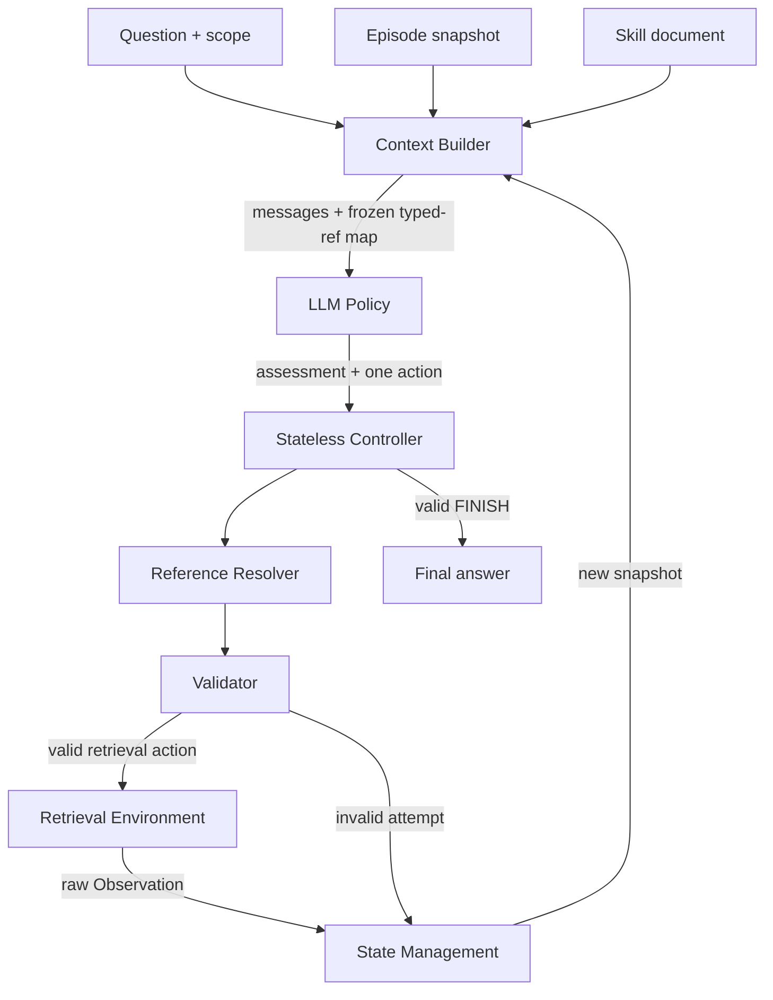
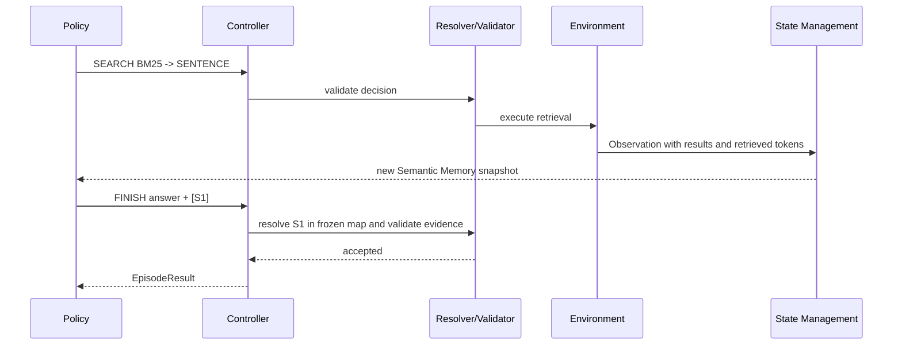

# Architecture

## High-level flow



The LLM remains the retrieval Policy. Infrastructure never chooses a search
method, target, graph relation, source node, or stopping point for it.

## Module contracts

| Module | High-level responsibility | Input | Output |
|---|---|---|---|
| State Management | Own the complete episode state and all counters | Observation or invalid-attempt record | Immutable snapshot for the next turn |
| Context Builder | Serialize state without recommending a next action | Question, Skill, snapshot, history | Policy messages and frozen visible-ref map |
| LLM Policy | Decide what information to obtain next | Structured context and action schema | Assessment plus one action |
| Controller | Orchestrate one loop without retaining data | Policy decision and same-turn frozen map | Invalid record, Observation, or final answer |
| Reference Resolver | Map visible `E#/S#/C#` to stable internal IDs | Raw action and frozen map | Resolved action or typed interface error |
| Validator | Enforce state/scope/evidence/duplicate rules | Resolved action and snapshot | Acceptance or validation error |
| Router | Execute accepted retrieval operations | Resolved SEARCH/EXPAND/READ | Raw Observation |

## Policy context

Every turn contains exactly these sections:

1. Question
2. Action protocol
3. Skill
4. Last assessment
5. Semantic Memory
6. Attempted actions
7. Remaining budget
8. Structured action schema supplied by the provider

There is no separate latest-event block and no action catalog. The budget is a
single line such as `Budget: 4 steps, 5 attempts, 3200 retrieval tokens left`.

Example memory:

```text
[E1] ENTITY
Name: Peter Daou

[S1] SENTENCE
Title: Verrit
Text: Peter Daou created Verrit.
Parent: C1

[C1] UNREAD_CHUNK
Title: Verrit
Preview: Verrit was a political website...
```

Refs are stable for the episode, but the Controller accepts only refs visible
in the exact frozen map sent with the decision. After C1 is read, sentences
fully contained by it remain in audit state but are folded out of the next
Policy view.

## Concrete turn



The second turn does not invoke a separate answer model; the same Policy emits
the answer and evidence refs.
