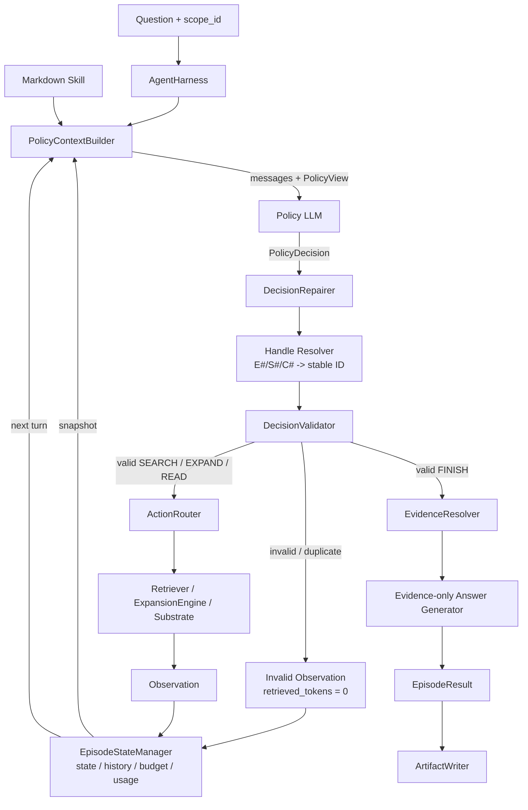

# Legacy / V1 技術報告

> 實作模式：`workflow_mode: legacy`
> 本文描述的是目前程式庫中仍可執行、可回歸測試的 Legacy 語意；它已運行在後來模組化完成的共用 runtime 上，不代表最初 commit 當時的檔案切分方式。文中的資料皆為 representative serialized examples，不是特定實驗題目的逐字 trace。

## 1. 定位與演進原因

Legacy / V1 是研究的基準工作流：同一個 Policy LLM 每輪同時產出「目前證據評估」與一個 `SEARCH`、`EXPAND`、`READ` 或 `FINISH`。它負責決定如何檢索與挑選證據，但在 `FINISH` 後，答案通常交由另一個 evidence-only Answer LLM 生成。

這一版建立了後續版本沿用的核心環境契約：multi-substrate 搜尋、圖擴展、chunk 閱讀、證據資格、budget、trajectory 與 validator。後續 V2 的主要動機，就是消除「Policy 找到證據後，再把證據交給另一個 LLM 回答」的資訊交接，並讓 evidence memory 能跨輪累積。

## 2. 高階設計邏輯

1. Context Builder 從 State Management 取得快照，加入 question、固定 action protocol 與 Skill。
2. Policy 一次輸出 `EvidenceAssessment + one Action`。
3. Controller 先做窄幅、可稽核的 repair，再解析題內 `E#/S#/C#` handle，交 Validator 檢查。
4. 合法的 `SEARCH/EXPAND/READ` 由 Router 執行，Observation 回到 State Management。
5. 合法的 `FINISH` 先解析 evidence，再由獨立 Answer Generator 僅根據該 evidence 作答。
6. Invalid decision 保留 policy attempt 與 trace，但不呼叫 retrieval、不扣 environment step；Legacy 仍受連續 invalid 上限約束。



## 3. 模組責任與精確 I/O

| 模組 | High-level purpose | Input | Output |
|---|---|---|---|
| `AgentHarness` | 組裝 provider-neutral runtime，啟動 episode，寫出 artifact。 | `Substrate`、`AgentConfig`、`SkillDocument`、Policy、Answer Generator、question、`scope_id` | `EpisodeResult` 與 episode artifact 目錄 |
| `SkillDocument` | 載入 plain Markdown retrieval strategy，以精確 bytes 計算版本 hash；Skill 只能提供策略，不能覆寫 protocol。 | UTF-8 Markdown file/text | content、source path、SHA-256/version |
| `PolicyContextBuilder` | 把內部 state 投影成不含 stable corpus ID 的 LLM context。預設使用 `compact_evidence`；也支援 `append_only` 基準。 | question、Skill Markdown、`ControllerState` snapshot、`StepRecord[]`、`scope_id` | `BuiltPolicyContext(messages, PolicyView)` |
| Policy provider adapter / LLM | 將 messages 送入 OpenAI/Ollama，依 enabled expansions 的動態 schema 解析唯一決策並記錄 usage。 | system protocol、Skill、question、policy-facing state、structured schema | `PolicyDecision {assessment, action}` 或 provider/response error |
| `AgentController` | 無狀態地協調 context → policy → repair → resolve → validate → execute/finish；每輪只讀 snapshot 並提交 AttemptEvent。 | question、scope、固定 dependencies、State Manager snapshots | AttemptEvents 或 terminal `EpisodeResult` |
| `DecisionRepairer` | 只修正可唯一判定的 inverse sentence/entity expansion；Legacy 不從 action 自動推導 assessment status。 | raw `PolicyDecision`、state snapshot | 原決策或 `DecisionRepairResult`，含可稽核 `repair_code` |
| Handle Resolver | 將 Policy 可見的 `E#/S#/C#` 映射回 stable substrate ID；不做 fuzzy matching。 | repaired decision、`NodeHandleRegistry`、Substrate | internal `PolicyDecision`；失敗為 `unknown_handle` / `handle_type_mismatch` |
| `DecisionValidator` | 檢查 scope、visibility、evidence eligibility、EXPAND source type、duplicate、assessment/FINISH 一致性。 | resolved decision、state snapshot、`scope_id` | `ValidationResult(ok, code, signature, resolved_decision)` |
| `ActionRouter` | 執行已驗證的 `SEARCH/EXPAND/READ`，並依 retrieval-token budget 截斷完整結果。 | resolved action、state、question、`scope_id`、`action_id` | raw `Observation`，含 results、retrieved tokens 與 controller metadata |
| `Retriever` | 執行合法的 lexical/BM25/dense search。 | query、method、target、scope、`top_k=5` | typed retrieval hits |
| `ExpansionEngine` | 沿已啟用的 graph relation 取得鄰接節點。 | `ExpandAction`、question、scope | expansion results、實際 ranking query、degree/candidate metadata |
| `Substrate` | 提供 documents/chunks/sentences/entities、scope index、graph edge 與 chunk read。 | stable node IDs / retrieval request | corpus node 或 scoped result |
| `EpisodeStateManager` | 唯一可變狀態擁有者；原子地記錄 attempt、history、budget 與 usage。Controller 本身不保存 episode 資料。 | `AttemptEvent` | 新 state snapshot、append-only `StepRecord`、最終 `EpisodeResult` |
| `StateUpdater` | 將 Observation 的 visibility delta、assessment、signature 與 budget transition 套用到 state。Legacy 的 selected evidence 採有效輪次整組替換。 | previous state、assessment、observation、signature、commit/consume flags | updated `ControllerState` |
| `EvidenceResolver` | 將通過驗證的 Sentence/Chunk refs 還原為完整、具 provenance 的 evidence。 | evidence refs、state、scope | `ResolvedEvidence[]` |
| Answer Generator | 只看 question 與 resolved evidence 產生答案，不能使用外部知識。 | question、`ResolvedEvidence[]` | non-empty answer string 與 answer usage |
| `ArtifactWriter` | 持久化 episode、trajectory、config、Skill 與 logical I/O trace；不保存 credential。 | `EpisodeResult` 與 runtime metadata | 可重播/稽核的檔案集合 |

## 4. Policy input / output contract

### 4.1 Policy 看見的 context

預設 `compact_evidence` 的最後一則 user message 是完整 `PolicyView`，核心欄位如下：

```json
{
  "instruction": "Produce the next PolicyDecision.",
  "policy_state": {
    "step": 1,
    "policy_attempts": 1,
    "last_valid_assessment": {
      "status": "INSUFFICIENT",
      "missing_information": ["The birthplace is unknown."]
    },
    "selected_evidence": [],
    "latest_observation": {
      "action_id": "attempt-1",
      "action": {
        "type": "SEARCH",
        "query": "Where was Marie Curie born?",
        "method": "BM25",
        "target": "SENTENCE",
        "top_k": 5
      },
      "outcome": "success",
      "results": [
        {
          "sentence_id": "S1",
          "text": "Marie Curie was born in Warsaw.",
          "parent_chunk_id": "C1",
          "title": "Marie Curie"
        }
      ],
      "usage": {"retrieved_tokens": 8},
      "error": null
    },
    "actionable_handles": [],
    "allowed_expansions": {
      "SENTENCE_MENTIONS_ENTITY": ["S1"],
      "CHUNK_ADJACENT_CHUNK": ["C1"]
    },
    "attempted_actions": [
      {
        "step": 1,
        "policy_attempt": 1,
        "action": {
          "type": "SEARCH",
          "query": "Where was Marie Curie born?",
          "method": "BM25",
          "target": "SENTENCE",
          "top_k": 5
        },
        "repaired_action": null,
        "repair_code": null,
        "validation_status": "valid",
        "observation_status": "ok",
        "error_code": null,
        "message": null,
        "new_node_count": 2,
        "retrieved_tokens": 8
      }
    ],
    "budget": {
      "remaining_steps": 9,
      "remaining_policy_attempts": 11,
      "remaining_retrieved_tokens": 11992
    }
  }
}
```

State 內部 stable IDs、visibility sets、action signatures 與 raw `visibility_delta` 不會暴露給 Policy。`append_only` 模式則逐輪重播先前 decision/observation，再附上目前 state；它是可比較的 context baseline，而非預設設定。

### 4.2 Policy 輸出

所有 action 都共用一個 assessment：

```json
{
  "assessment": {
    "status": "INSUFFICIENT",
    "supported_facts": [],
    "missing_information": ["Marie Curie's birthplace"],
    "selected_evidence_refs": []
  },
  "action": {
    "type": "SEARCH",
    "query": "Where was Marie Curie born?",
    "method": "BM25",
    "target": "SENTENCE",
    "top_k": 5
  }
}
```

合法 SEARCH 組合固定為：

- `LEXICAL -> ENTITY`
- `BM25 -> SENTENCE | CHUNK`
- `DENSE -> ENTITY | SENTENCE | CHUNK`

其他 action 的 wire shape：

```json
{"type":"EXPAND","kind":"SENTENCE_MENTIONS_ENTITY","source_id":"S1","direction":null,"query":null,"top_k":5}
```

```json
{"type":"READ","chunk_id":"C1"}
```

```json
{
  "type": "FINISH",
  "evidence_refs": [{"unit":"SENTENCE","id":"S1"}]
}
```

Legacy live provider schema不要求 `FINISH.answer`。`assessment.status` 必須是 `SUFFICIENT`，且每一個 FINISH ref 必須同時出現在同一輪 `assessment.selected_evidence_refs`。

## 5. Representative end-to-end example

題目：`Where was Marie Curie born?`

第一輪 Policy 選擇上節的 BM25 sentence search。Router 的 raw Observation 代表如下；其中 stable IDs 只存在 environment/audit，下一輪 Policy 會看到 `S1/C1`：

```json
{
  "action_id": "attempt-1",
  "status": "OK",
  "action": {
    "type": "SEARCH",
    "query": "Where was Marie Curie born?",
    "method": "BM25",
    "target": "SENTENCE",
    "top_k": 5
  },
  "results": [
    {
      "sentence_id": "sentence:marie-born",
      "text": "Marie Curie was born in Warsaw.",
      "parent_chunk_id": "chunk:marie-0",
      "document_id": "document:marie-curie",
      "title": "Marie Curie"
    }
  ],
  "retrieved_tokens": 8,
  "novel_node_ids": ["sentence:marie-born", "chunk:marie-0"]
}
```

第二輪 Policy 完成 evidence selection：

```json
{
  "assessment": {
    "status": "SUFFICIENT",
    "supported_facts": ["Marie Curie was born in Warsaw."],
    "missing_information": [],
    "selected_evidence_refs": [
      {"unit":"SENTENCE","id":"S1"}
    ]
  },
  "action": {
    "type":"FINISH",
    "evidence_refs":[{"unit":"SENTENCE","id":"S1"}]
  }
}
```

Controller 將 `S1` 解析成 stable sentence、Validator 確認它可見且為完整 sentence，再送給 Answer Generator：

```json
{
  "question": "Where was Marie Curie born?",
  "evidence": [
    {
      "ref": {"unit":"SENTENCE","id":"sentence:marie-born"},
      "text": "Marie Curie was born in Warsaw.",
      "document_id": "document:marie-curie",
      "title": "Marie Curie",
      "parent_chunk_id": "chunk:marie-0"
    }
  ]
}
```

Answer Generator 回傳 `Warsaw`，並獨立計入 `answer_calls` 與 answer token usage。

## 6. Validation、error 與 budget 語意

主要介面/狀態錯誤包括：

| Error code | 觸發條件 | 是否執行 retrieval / 消耗 step |
|---|---|---|
| `invalid_policy_response` | provider output 無法通過 structured schema | 否 / 否 |
| `unknown_handle` | ref 未出現在題內 registry | 否 / 否 |
| `handle_type_mismatch` | 例如需 `E#` 卻給 `S#` | 否 / 否 |
| `duplicate_action` | resolved action signature 已成功嘗試過 | 否 / 否 |
| `source_not_visible` / `source_out_of_scope` | EXPAND/READ source 不可用 | 否 / 否 |
| `source_not_complete` | preview sentence 尚未由 READ 變成完整 evidence | 否 / 否 |
| `chunk_already_read` | 重讀同一 chunk | 否 / 否 |
| `selected_evidence_not_visible` / `_out_of_scope` / `_not_eligible` | assessment 選了非法 evidence | 否 / 否 |
| `finish_requires_sufficient` / `sufficient_requires_finish` | assessment 與 action 不一致 | 否 / 否 |
| `finish_evidence_not_selected` | FINISH ref 未出現在同輪 assessment selection | 否 / 否 |
| `retrieved_token_budget_exceeded` | 一個完整結果也放不進剩餘 retrieval budget | Tool 回傳 error；該次為已執行的合法 action |

每個 invalid 仍消耗一次 Policy attempt 並保存 raw decision、validation error 與 audit trace。Legacy 達到 `max_consecutive_invalid_attempts` 時可提前以 `invalid_action_retry_exhausted` 終止；正常合法 retrieval 才消耗 environment step。若 retrieval 關閉但已有 eligible evidence，Controller 可做一次 budget-finalize Policy call。

## 7. 與下一版 V2 的關鍵差異

| 面向 | Legacy / V1 | V2 |
|---|---|---|
| 最終答案 | 獨立 evidence-only Answer Generator | Policy 的 `FINISH.answer` 直接作答 |
| selected evidence | 每個有效 assessment 整組替換 | 跨輪累積、依首次出現順序去重 |
| status 修正 | 不從 action 自動推導 | `FINISH`/continue 可自動修正 assessment status |
| Invalid recovery | 連續 invalid 可提早終止 | 加 recovery instruction，主要由 attempt budget 約束 |
| LLM call 交接 | Policy + Answer 兩個角色 | 同一 Agent 完成 retrieval 與 answer |

## 8. 對應實作、設定與測試

核心 source：

- `src/agentic_rag/agent/harness.py`
- `src/agentic_rag/agent/controller.py`
- `src/agentic_rag/agent/context.py` 的 `ACTION_PROTOCOL` 與 `PolicyContextBuilder`
- `src/agentic_rag/agent/models.py` 的 `PolicyDecision`、`EvidenceAssessment`、`ControllerState`
- `src/agentic_rag/agent/handle_resolution.py`
- `src/agentic_rag/agent/repair.py`
- `src/agentic_rag/agent/validator.py`
- `src/agentic_rag/agent/router.py`
- `src/agentic_rag/agent/state_management.py` 與 `state.py`
- `src/agentic_rag/agent/evidence.py`
- `src/agentic_rag/agent/answer.py`
- `src/agentic_rag/agent/artifacts.py`

代表設定與 Skill：

- `configs/agentic_hotpotqa.yaml`（未指定 `workflow_mode` 時預設為 `legacy`）
- `configs/agentic_hotpotqa_ollama.yaml`
- `skills/initial.md`
- `skills/hotpotqa_skillopt_initial.md`

主要 regression tests：

- `tests/test_agent_controller.py`
- `tests/test_agent_contracts.py`
- `tests/test_compact_policy_context.py`
- `tests/test_handle_runtime.py`
- `tests/test_state_management.py`
- `tests/test_agent_artifacts.py`

## 9. 已知限制

- Policy 必須同時進行 evidence assessment、引用與 action planning，結構負擔高。
- `E#/S#/C#` 是無語意 opaque handle；模型必須把語意內容與正確類型/編號同時對齊，容易出現 type mismatch 或 invented handle。
- selected evidence 是整組替換；某輪漏列先前證據就會從 working set 消失。
- 最終回答另開一次 LLM call，增加 token 與 latency，且可能在 Policy 到 Answer 的交接中失去原本的比較/限定語意。
- `actionable_handles`、`allowed_expansions`、attempt history 與 observation 同時出現在 context，資訊完整但 UI 負擔高。
- Legacy 的連續 invalid 會提早終止，對較小、較不穩定的 local model 特別不利。
