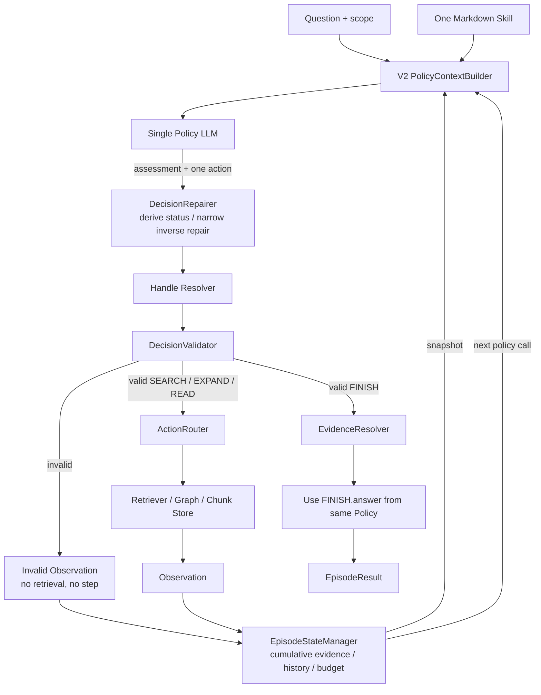

# Single-Agent V2 技術報告

> 實作模式：`workflow_mode: single_agent_v2`
> V2 保留 Legacy 的 `E#/S#/C#` action/evidence contract，但將 retrieval planning 與 final answer 合併到同一個 Agent。文中的序列化資料為 representative examples。

## 1. 定位與演進原因

V2 解決 Legacy 的兩個核心問題：

1. Policy 已理解題目與檢索軌跡，卻在 FINISH 時只傳 evidence 給另一個 Answer LLM，容易增加 call/token 並造成語意交接損失。
2. Legacy 每個有效 assessment 會替換 working evidence；多跳問題若某輪漏選先前證據，證據記憶會消失。

因此 V2 讓同一個 Policy Agent 在 `FINISH.answer` 直接回答，並讓 State Management 累積每輪新選中的 evidence。Controller 仍只負責協調、解析、驗證與執行，不替 Agent 決定哪個 retrieval action 比較好。

## 2. 高階設計邏輯

1. Context Builder 將累積證據、最新 Observation、可操作 handles、allowed expansions、attempt history 與 budget 組成 context。
2. 同一個 Policy LLM 每輪輸出 assessment 與一個 action；SEARCH、EXPAND、READ、FINISH 始終屬於 Policy 決策。
3. Repairer 可從 action 類型推導 assessment status，並只修復可唯一判定的 sentence/entity inverse expansion。
4. Controller 解析 `E#/S#/C#`、驗證，合法 retrieval 才交給 Router。
5. State Management 原子累積 validated assessment 的 selected evidence；invalid 不寫入 evidence memory、不消耗 environment step。
6. FINISH 直接使用 Policy 回傳的 answer；正常 live run 不再呼叫第二個 Answer LLM。



## 3. 模組責任與精確 I/O

| 模組 | High-level purpose | Input | Output |
|---|---|---|---|
| `AgentHarness` | 根據 `single_agent_v2` 組裝 direct-answer Policy schema、累積 evidence 的 StateUpdater 與共用 runtime。 | config、Substrate、Skill、providers、question、scope | `EpisodeResult` 與 artifacts |
| `SkillDocument` | 載入單一 plain Markdown retrieval Skill 並以內容 hash 固定實驗版本。 | UTF-8 Markdown file/text | Skill content、source、SHA-256 |
| `PolicyContextBuilder` | 產生 V2 protocol 與完整 `PolicyStateView`，向 Policy 顯示 semantic content 加 typed handles。 | question、Skill、state snapshot、trajectory、scope | messages + full `PolicyView` |
| Policy provider adapter / Single LLM | 同時做缺漏判斷、retrieval action 選擇與最終回答，並回報 call/token usage。 | V2 messages、動態 `PolicyDecision` schema | `PolicyDecision`；live FINISH 必含 `answer` |
| `AgentController` | 無狀態地驅動單 Agent loop、invalid recovery 與 budget-finalize；不保存 evidence/history。 | question/scope、fixed dependencies、State Manager snapshots | AttemptEvents 或 terminal result |
| `DecisionRepairer` | 讓 action 成為 terminal/continue 的權威：FINISH 自動對齊 `SUFFICIENT`，其他 action 對齊 `INSUFFICIENT`；另保留窄幅 inverse expansion repair。 | raw decision、state | effective decision + optional `repair_code` |
| Handle Resolver | 將 Policy handle 精確映射成 stable ID。 | effective decision、registry、Substrate | internal decision 或 resolution error |
| `DecisionValidator` | 驗證 action 與 evidence 的 runtime 合法性，不看 ground truth。 | resolved decision、state、scope | valid signature 或 structured error |
| `ActionRouter` | 執行 SEARCH/EXPAND/READ；FINISH 不進 Retriever。 | validated non-terminal action、state、question、scope、action ID | `Observation` |
| `Retriever` / `ExpansionEngine` / `Substrate` | 執行 corpus search、graph traversal 與 full-chunk read。 | stable request | raw scoped results |
| `EpisodeStateManager` | 唯一 state/history/budget/usage 擁有者，接收 AttemptEvent 後原子 commit。 | `AttemptEvent` | snapshot、trajectory、result |
| `StateUpdater` | 更新 visibility、eligibility、read state、handles、budget 與 assessment；V2 使用 `accumulate_selected_evidence=True`。 | previous state + validated observation/assessment | accumulated `ControllerState` |
| `EvidenceResolver` | 將最終 evidence refs 解析成完整 text/provenance。 | merge 後 evidence refs、state、scope | `ResolvedEvidence[]` |
| Answer Generator fallback | 僅相容舊 scripted decision 缺少 `FINISH.answer` 的情況；native V2 live schema不走此路徑。 | question + evidence | fallback answer |
| `ArtifactWriter` | 保存 raw/repaired/resolved decision、policy view、observation、state before/after、usage。 | episode data | logical I/O trace 與 snapshots |

Controller 是無狀態 orchestrator：它每輪讀 State Manager snapshot、送出 AttemptEvent，不另外保存 history 或 evidence。

## 4. Policy input / output contract

### 4.1 V2 context

Policy call 依序包含：

1. `V2_ACTION_PROTOCOL` 與本次 enabled expansion 說明。
2. 完整 Markdown Skill。
3. Original question。
4. `PolicyView` JSON。
5. 若上一輪為 invalid/duplicate，再加一則 recovery instruction。

代表性的 policy state：

```json
{
  "instruction": "Produce the next PolicyDecision.",
  "policy_state": {
    "step": 2,
    "policy_attempts": 2,
    "last_valid_assessment": {
      "status": "INSUFFICIENT",
      "missing_information": ["The country containing Warsaw"]
    },
    "selected_evidence": [
      {
        "ref": {"unit":"SENTENCE","id":"S1"},
        "text": "Marie Curie was born in Warsaw.",
        "title": "Marie Curie",
        "parent_chunk_id": "C1"
      }
    ],
    "latest_observation": {
      "action_id": "attempt-2",
      "action": {
        "type": "SEARCH",
        "query": "Which country is Warsaw in?",
        "method": "BM25",
        "target": "SENTENCE",
        "top_k": 5
      },
      "outcome": "success",
      "results": [
        {
          "sentence_id": "S2",
          "text": "Warsaw is the capital of Poland.",
          "parent_chunk_id": "C2",
          "title": "Warsaw"
        }
      ],
      "usage": {"retrieved_tokens": 7},
      "error": null
    },
    "actionable_handles": [],
    "allowed_expansions": {
      "SENTENCE_MENTIONS_ENTITY": ["S1", "S2"],
      "CHUNK_ADJACENT_CHUNK": ["C1", "C2"]
    },
    "attempted_actions": [
      {
        "step": 1,
        "policy_attempt": 1,
        "action": {
          "type": "SEARCH",
          "query": "Where was Marie Curie born?",
          "method": "BM25",
          "target": "SENTENCE",
          "top_k": 5
        },
        "repaired_action": null,
        "repair_code": null,
        "validation_status": "valid",
        "observation_status": "ok",
        "error_code": null,
        "message": null,
        "new_node_count": 2,
        "retrieved_tokens": 8
      },
      {
        "step": 2,
        "policy_attempt": 2,
        "action": {
          "type": "SEARCH",
          "query": "Which country is Warsaw in?",
          "method": "BM25",
          "target": "SENTENCE",
          "top_k": 5
        },
        "repaired_action": null,
        "repair_code": null,
        "validation_status": "valid",
        "observation_status": "ok",
        "error_code": null,
        "message": null,
        "new_node_count": 2,
        "retrieved_tokens": 7
      }
    ],
    "budget": {
      "remaining_steps": 8,
      "remaining_policy_attempts": 10,
      "remaining_retrieved_tokens": 11985
    }
  }
}
```

`selected_evidence` 是 State Management 已累積、已解析成完整文字的 working evidence。剛出現在最新 Observation 的完整 sentence 也可在當輪 assessment 中新增，不必先等下一輪變成 actionable handle。

### 4.2 V2 output

非終止 action 的 contract 與 Legacy 相同。例如：

```json
{
  "assessment": {
    "status": "INSUFFICIENT",
    "supported_facts": ["Marie Curie was born in Warsaw."],
    "missing_information": ["Whether Warsaw is in Poland"],
    "selected_evidence_refs": [
      {"unit":"SENTENCE","id":"S1"}
    ]
  },
  "action": {
    "type": "SEARCH",
    "query": "Which country is Warsaw in?",
    "method": "BM25",
    "target": "SENTENCE",
    "top_k": 5
  }
}
```

Native V2 FINISH 的 structured schema要求直接答案：

```json
{
  "assessment": {
    "status": "SUFFICIENT",
    "supported_facts": [
      "Marie Curie was born in Warsaw.",
      "Warsaw is the capital of Poland."
    ],
    "missing_information": [],
    "selected_evidence_refs": [
      {"unit":"SENTENCE","id":"S1"},
      {"unit":"SENTENCE","id":"S2"}
    ]
  },
  "action": {
    "type": "FINISH",
    "answer": "Poland",
    "evidence_refs": [
      {"unit":"SENTENCE","id":"S1"},
      {"unit":"SENTENCE","id":"S2"}
    ]
  }
}
```

`SEARCH` 不需要任何現有 node ref；`EXPAND.source_id`、`READ.chunk_id` 與 evidence refs 才使用 `E#/S#/C#`。所有合法 SEARCH pair、`top_k=5` 與 EXPAND direction 規則仍由 provider schema + validator 共同約束。

## 5. Representative state transition

假設第一輪 SEARCH 取得：

```json
{
  "action_id":"attempt-1",
  "outcome":"success",
  "results":[
    {
      "sentence_id":"S1",
      "text":"Marie Curie was born in Warsaw.",
      "parent_chunk_id":"C1",
      "title":"Marie Curie"
    }
  ],
  "usage":{"retrieved_tokens":8},
  "error":null
}
```

第二輪 assessment 選入 `S1` 並繼續 SEARCH。這個合法 action commit 後，StateUpdater 做的是 union-with-order：

```text
before selected evidence: []
current assessment refs:  [S1]
after selected evidence:  [stable sentence behind S1]
```

第三輪 assessment 只需新增 `S2` 時，state 會成為 `[S1, S2]`，而不是把 `S1` 移除。FINISH 時 `_finish_result` 再把歷史累積 refs 與當輪 FINISH refs 去重合併，因此 artifact 保留完整 final evidence set。

如果第二輪 action 因為 `source_id: S999` 無效：

```json
{
  "action_id":"attempt-2",
  "outcome":"invalid_action",
  "results":[],
  "usage":{"retrieved_tokens":0},
  "error":{
    "code":"unknown_handle",
    "message":"Unknown ENTITY handle: S999",
    "retryable":true,
    "details":{"expected_type":"ENTITY"}
  }
}
```

該 assessment 不會被 commit，`selected_evidence` 仍保持 invalid 前的內容；policy attempt 減一，但 step 與 retrieved-token budget 不變。

## 6. Validation、repair 與 recovery

V2 仍使用 Legacy 的主要 validator codes：

- Schema/resolution：`invalid_policy_response`、`unknown_handle`、`handle_type_mismatch`
- 重複：`duplicate_action`
- EXPAND/READ：`disabled_expansion`、`source_not_visible`、`source_out_of_scope`、`source_not_complete`、`chunk_already_read`
- Evidence：`selected_evidence_not_visible`、`selected_evidence_out_of_scope`、`selected_evidence_not_eligible`
- FINISH：`finish_evidence_not_selected`、`evidence_not_eligible`、`evidence_out_of_scope`

V2 額外的重要 recovery 語意：

- `DecisionRepairer` 看到 FINISH + 非 SUFFICIENT 時，修成 SUFFICIENT，trace 記錄 `finish_status_derived_from_action`。
- 非 FINISH + SUFFICIENT 則修成 INSUFFICIENT，記錄 `continue_status_derived_from_action`。
- 可唯一判斷時，`ENTITY_MENTIONED_IN_SENTENCE` 搭配 `S#` 或反向情況可改成正確 inverse kind，記錄 `expand_direction_repaired_from_handle_type`；未知 handle、READ、FINISH 與模糊關係不猜。
- invalid/duplicate 後，下一個 context 會加入「不要重複、只複製目前合法 handle；證據足夠則 FINISH」的 recovery instruction。
- Single-agent mode 不因兩次 consecutive invalid 立刻退出，仍由 `remaining_policy_attempts` 限制；invalid 始終不消耗 environment step。

## 7. 相對 Legacy / V1 的修改

| 修改 | 實作原因 | 行為影響 |
|---|---|---|
| `FINISH.answer` 改為 live schema 必填 | 避免第二個 answer agent 的語意/成本交接 | 一般完成題目只需 Policy calls，`answer_calls=0` |
| `accumulate_selected_evidence=True` | 多跳 evidence 不因單輪漏列而消失 | validated assessment 新 refs 按首次出現順序累積 |
| action 決定 status | 減少「想 FINISH 卻填錯 assessment enum」的無效輪次 | status mismatch 可被窄幅 repair |
| V2 recovery prompt | 讓同一 Agent 看見上一輪失敗後能修正 | invalid 仍保留 audit，但不提前因固定兩次而終止 |
| Answer Generator 降為 fallback | 相容 scripted / legacy API | native provider 不呼叫 fallback |

## 8. 對應實作、設定與測試

V2-specific / shared source：

- `src/agentic_rag/agent/context.py`：`V2_ACTION_PROTOCOL`、`V2_RECOVERY_INSTRUCTION`
- `src/agentic_rag/agent/controller.py`：single-agent path、direct FINISH、budget finalize
- `src/agentic_rag/agent/harness.py`：workflow wiring、`direct_answer=True`
- `src/agentic_rag/agent/models.py`：`PolicyDecision`、`FinishAction.answer`
- `src/agentic_rag/agent/policy.py`：direct-answer provider schema
- `src/agentic_rag/agent/repair.py`
- `src/agentic_rag/agent/state.py`：cumulative evidence merge
- `src/agentic_rag/agent/state_management.py`
- `src/agentic_rag/agent/handle_resolution.py`
- `src/agentic_rag/agent/validator.py`
- `src/agentic_rag/agent/router.py`

代表設定與 Skill：

- `configs/agentic_hotpotqa_luna_v2.yaml`
- `configs/agentic_hotpotqa_qwen35_9b_v2.yaml`
- `skills/hotpotqa_single_agent_v2.md`
- `skills/hotpotqa_v2_a_evidence_adaptive.md`
- `skills/hotpotqa_v2_b_chunk_entity_expert.md`
- `skills/hotpotqa_v2_c_posthoc_guarded.md`

主要 tests：

- `tests/test_single_agent_v2.py`
- `tests/test_agent_controller.py`
- `tests/test_compact_policy_context.py`
- `tests/test_handle_runtime.py`
- `tests/test_state_management.py`
- `tests/test_v2_skill_variations.py`

## 9. 已知限制

- Policy context 同時包含 `selected_evidence`、`latest_observation`、`actionable_handles`、`allowed_expansions` 與完整 attempted-action projection；許多 capability 欄位彼此重複。
- `E#/S#/C#` 雖節省 token，但不具語意。模型可能理解「Marie Curie」卻在 action field 複製錯 handle 類型或號碼。
- `selected_evidence_refs` 同時承擔「working memory 保留」與「FINISH citation」兩種責任，使 assessment contract 偏重。
- `allowed_expansions` 是逐 kind 的 source-handle 清單；它能防錯，但也可能讓模型把既有 graph targets 誤認為下一步 action scope，減少重新 SEARCH。
- 完整 capability protocol 與 expansion 說明有助較強模型，但也提高每次 input token。
- Cumulative evidence 只累積 Policy 明確選中的項目；檢索到但未選入的 novel evidence 不保證長期留在 selected evidence 區。
