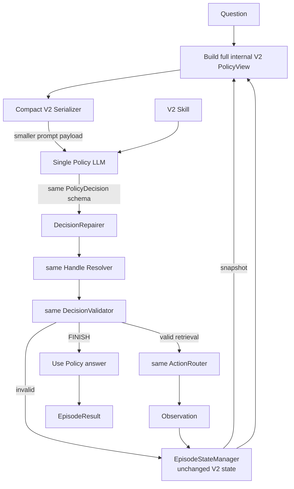

# V2 Compact 技術報告

> 實作模式：`workflow_mode: single_agent_v2_compact`
> V2 Compact 是「Policy 介面壓縮 ablation」，不是新的 retrieval/state semantics。它與 V2 使用相同 action schema、handle resolver、validator、Controller、State Management 與 evidence accumulation。文中的資料為 representative examples。

## 1. 定位與演進原因

V2 的功能完整，但 Policy context 有明顯介面負擔：同一節點可能同時出現在 observation、selected evidence、actionable handles、allowed expansions 與 attempted-actions record，並重複 `can_expand`、`can_read` 等能力旗標。

V2 Compact 的研究問題是：**只壓縮 LLM 看見的 state serializer，不改 state、action space 或 validator，能否降低 token 且維持決策品質？**

它因此保留：

- V2 的累積 `selected_evidence_refs`
- V2 的 `E#/S#/C#` opaque handles
- V2 的 `PolicyDecision` 與 direct `FINISH.answer`
- 相同 SEARCH/EXPAND/READ/FINISH、budget 與 retrieval substrate

它只把 policy-facing payload 改為 `selected_evidence / latest_observation / known_nodes / expand_sources / action_history / budget`，並刪除重複 capability UI。

## 2. 高階流程



關鍵點是：`PolicyContextBuilder` 仍先建立未縮減的 `PolicyView`，供 Controller-side resolution、validation 與 audit 使用；只有送給 LLM 的 JSON 經 `_compact_v2_payload()` 壓縮。因此這個變體能將「介面呈現」作為單獨自變因。

## 3. 模組責任與精確 I/O

| 模組 | High-level purpose | Input | Output |
|---|---|---|---|
| `AgentHarness` | 將 `single_agent_v2_compact` 同時 wiring 成 V2 single-agent semantics 與 compact serializer。 | config、Substrate、Skill、providers | V2-compatible runtime |
| `SkillDocument` | 載入與 V2 相同的單一 Markdown strategy 並保存內容 hash。 | UTF-8 Markdown file/text | Skill content、source、SHA-256 |
| `PolicyContextBuilder.build_policy_view` | 先建立與原始 V2 相同的完整 internal PolicyView，避免控制層能力退化。 | state、trajectory、scope | full `PolicyView` |
| `_compact_v2_payload` | 只壓縮 LLM-facing serialization，移除重複欄位與 capability flags。 | full PolicyView、state、trajectory | `{instruction, state}` compact JSON |
| `_compact_v2_handle` | 將 Entity/Sentence/Chunk handle 投影為最小 semantic record。 | `PolicyNodeHandle` | compact node dict |
| `_compact_v2_attempt_summary` | 將完整 audit record 壓成 action、outcome、error code。 | `StepRecord`、state | compact action-history item |
| Policy provider adapter / LLM | 在壓縮 state 上做與 V2 相同的 assessment/action/answer 決策並計量 usage。 | compact messages + 相同 structured schema | `PolicyDecision` 或 provider/response error |
| `AgentController` | 與 V2 相同的無狀態 orchestration；使用完整 state 驗證，不把 compact serializer 當 state truth。 | question/scope、snapshots、policy output | AttemptEvents 或 terminal result |
| `DecisionRepairer` | 與 V2 相同：status derivation + narrow inverse expansion repair。 | decision + state | effective decision |
| Handle Resolver | 與 V2 相同：精確處理 `E#/S#/C#`。 | decision、registry、Substrate | stable-ID decision 或 error |
| `DecisionValidator` | 與 V2 相同；使用 full state，而非 compact prompt 猜測能力。 | resolved decision、state、scope | `ValidationResult` |
| `ActionRouter` / environment | 與 V2 相同的 SEARCH/EXPAND/READ。 | valid action | Observation |
| `EpisodeStateManager` / `StateUpdater` | 與 V2 相同地累積 evidence、更新 visibility/budget/history。 | AttemptEvent | updated state + trace |
| `EvidenceResolver` | 與 V2 相同地解析 final evidence。 | refs、state、scope | `ResolvedEvidence[]` |
| `ArtifactWriter` | 同時保留 compact Policy input 與完整 controller/audit state。 | episode records | artifacts / logical trace |

## 4. Policy input / output contract

### 4.1 Compact context shape

```json
{
  "instruction": "Choose exactly one next action.",
  "state": {
    "step": 1,
    "policy_attempts": 1,
    "last_assessment": {
      "status": "INSUFFICIENT",
      "missing_information": ["The birthplace is unknown."]
    },
    "selected_evidence": [],
    "latest_observation": {
      "action_id": "attempt-1",
      "action": {
        "type": "SEARCH",
        "query": "Where was Marie Curie born?",
        "method": "BM25",
        "target": "SENTENCE",
        "top_k": 5
      },
      "outcome": "success",
      "results": [
        {
          "sentence_id": "S1",
          "text": "Marie Curie was born in Warsaw.",
          "parent_chunk_id": "C1",
          "title": "Marie Curie"
        }
      ],
      "usage": {"retrieved_tokens": 8},
      "error": null
    },
    "known_nodes": [
      {
        "type": "ENTITY",
        "id": "E1",
        "name": "Marie Curie",
        "entity_type": "PERSON"
      }
    ],
    "expand_sources": {
      "ENTITY_MENTIONED_IN_SENTENCE": ["E1"],
      "SENTENCE_MENTIONS_ENTITY": ["S1"],
      "CHUNK_ADJACENT_CHUNK": ["C1"]
    },
    "action_history": [
      {
        "attempt": 1,
        "action": {
          "type": "SEARCH",
          "query": "Where was Marie Curie born?",
          "method": "BM25",
          "target": "SENTENCE",
          "top_k": 5
        },
        "outcome": "success",
        "error_code": null
      }
    ],
    "budget": {
      "remaining_steps": 9,
      "remaining_policy_attempts": 11,
      "remaining_retrieved_tokens": 11992
    }
  }
}
```

實際 serializer 會把已在 `selected_evidence` 或 `latest_observation` 代表的節點從 `known_nodes` 排除，以避免同一內容重播。`expand_sources` 是 Validator contract 所需的最小 `kind -> legal source handles` map，不代表建議優先 EXPAND；protocol 明確聲明 SEARCH 永遠可用。

### 4.2 刪除的 Policy UI

相較完整 V2，LLM payload 不再出現以下名稱/重複資訊：

- `actionable_handles`
- `allowed_expansions`
- `attempted_actions` 的完整 validation/message/token/new-node record
- 每個 node 重複的 `can_expand`
- Chunk 的 `can_read`
- 每種 expansion 的長篇逐項 guidance；改為 `KIND(source_type)` 單行摘要

這些資料仍可能保留在 internal `PolicyView`、state 或 artifact，並沒有從系統控制層刪除。

### 4.3 Output contract 完全不變

V2 Compact 仍輸出同一個 `PolicyDecision`：

```json
{
  "assessment": {
    "status": "SUFFICIENT",
    "supported_facts": ["Marie Curie was born in Warsaw."],
    "missing_information": [],
    "selected_evidence_refs": [
      {"unit":"SENTENCE","id":"S1"}
    ]
  },
  "action": {
    "type":"FINISH",
    "answer":"Warsaw",
    "evidence_refs":[{"unit":"SENTENCE","id":"S1"}]
  }
}
```

SEARCH 仍不依賴 handle；EXPAND 使用 `source_id`；READ 使用 `chunk_id`；FINISH 使用 typed evidence refs。所有 schema、resolution 與 eligibility 規則都與 V2 相同。

## 5. Representative read / expand example

假設 chunk search 回傳 unread `C2` 與 preview：

```json
{
  "latest_observation": {
    "outcome": "success",
    "results": [
      {
        "chunk_id": "C2",
        "title": "Motörhead",
        "previews": [
          {"sentence_id":"S4","text":"..."}
        ]
      }
    ],
    "usage": {"retrieved_tokens": 62},
    "error": null
  },
  "known_nodes": [],
  "expand_sources": {
    "CHUNK_ADJACENT_CHUNK": ["C2"]
  }
}
```

Policy 仍可選 READ：

```json
{
  "assessment": {
    "status":"INSUFFICIENT",
    "supported_facts":[],
    "missing_information":["The preview lacks the requested fact."],
    "selected_evidence_refs":[]
  },
  "action":{"type":"READ","chunk_id":"C2"}
}
```

也可重新 SEARCH，完全不必使用 `expand_sources`：

```json
{
  "assessment": {
    "status":"INSUFFICIENT",
    "supported_facts":[],
    "missing_information":["A direct sentence naming the band is missing."],
    "selected_evidence_refs":[]
  },
  "action":{
    "type":"SEARCH",
    "query":"Which band recorded the album described in the question?",
    "method":"BM25",
    "target":"SENTENCE",
    "top_k":5
  }
}
```

如果 Agent 選 `CHUNK_ADJACENT_CHUNK`，仍必須自行輸出 direction：

```json
{
  "type":"EXPAND",
  "kind":"CHUNK_ADJACENT_CHUNK",
  "source_id":"C2",
  "direction":"NEXT",
  "query":"Which adjacent section identifies the performer?",
  "top_k":5
}
```

## 6. Validator / error 與狀態語意

V2 Compact 沒有新增 resolver 或 validator code。它完整沿用 V2 的：

- `unknown_handle`、`handle_type_mismatch`
- `duplicate_action`
- `source_not_visible`、`source_out_of_scope`、`source_not_complete`
- `chunk_already_read`
- `selected_evidence_not_visible`、`selected_evidence_out_of_scope`、`selected_evidence_not_eligible`
- `finish_evidence_not_selected`、`evidence_not_eligible`、`evidence_out_of_scope`
- `invalid_policy_response` 與 retrieval-budget errors

Invalid action 的 raw decision、error 與 compact history 都會保留；不執行 retrieval、不消耗 environment step，但消耗 policy attempt。State Management 仍以 stable IDs 作真實狀態，compact context 不會改變 frozen validation predicates。

## 7. 相對 V2 的修改

| 面向 | V2 | V2 Compact |
|---|---|---|
| State truth | `ControllerState` | 完全相同 |
| Evidence memory | validated assessment refs 累積 | 完全相同 |
| Action schema | `PolicyDecision` + E/S/C handles | 完全相同 |
| Context payload | 完整 `PolicyStateView` | compact `{instruction, state}` |
| Node 能力 | `can_expand/can_read/can_use_as_evidence` 多處呈現 | 保留必要 eligibility/read；expand legality集中為 `expand_sources` |
| History | 完整 attempted action projection | `{attempt, action, outcome, error_code}` |
| Expansion protocol | 每 kind 的詳細語意說明 | kind + required source type 摘要 |
| Controller/validator | 原始 V2 | 原始 V2；未變 |

因此，如果 V2 Compact 的表現、invalid 次數或 policy calls 改變，合理歸因是 **Policy 看見的介面資訊不同**，而不是 retriever、budget 或 state transition 改變。

## 8. 對應實作、設定與測試

核心 source：

- `src/agentic_rag/agent/context.py`
  - `V2_COMPACT_ACTION_PROTOCOL`
  - `PolicyContextBuilder._compact_v2_payload`
  - `_compact_v2_handle`
  - `_compact_v2_attempt_summary`
  - `_compact_expansion_source_type`
- `src/agentic_rag/agent/harness.py` 的 `single_agent_v2_compact` wiring
- 其餘 runtime 與 V2 共用：`controller.py`、`models.py`、`repair.py`、`handle_resolution.py`、`validator.py`、`router.py`、`state.py`、`state_management.py`

代表設定：

- `configs/agentic_hotpotqa_luna_v2_compact.yaml`

主要 tests：

- `tests/test_single_agent_v2_compact.py`
- `tests/test_compact_policy_context.py`
- `tests/test_single_agent_v2.py`（共享語意 regression）
- `tests/test_handle_runtime.py`
- `tests/test_state_management.py`

## 9. 已知限制與實驗解讀

- 壓縮掉逐 relation 的詳細 expansion 說明後，模型可能知道 `CHUNK_ADJACENT_CHUNK(C)` 合法，卻較不容易想到「答案可能在相鄰 chunk」這個策略用途。
- `expand_sources` 雖比原始 `allowed_expansions` 精簡，仍可能形成 action-scope bias，讓模型過度聚焦現有 node 而少做新 SEARCH。
- 仍使用 opaque `E#/S#/C#`；compact 並沒有解決 handle 與語意分離問題。
- 仍需由 assessment 主動選取 evidence；沒有 V3 的自動 semantic-memory retention。
- 介面變短不保證總 token 下降：如果缺少提示使 invalid、recovery 或額外 retrieval 增加，policy call 數可能抵銷單次 prompt 節省。
- 目前只應將它視為 prompt/state-presentation ablation；不能把單次 20 題結果解讀為新的 architecture 優於或劣於 V2 的統計因果結論。
