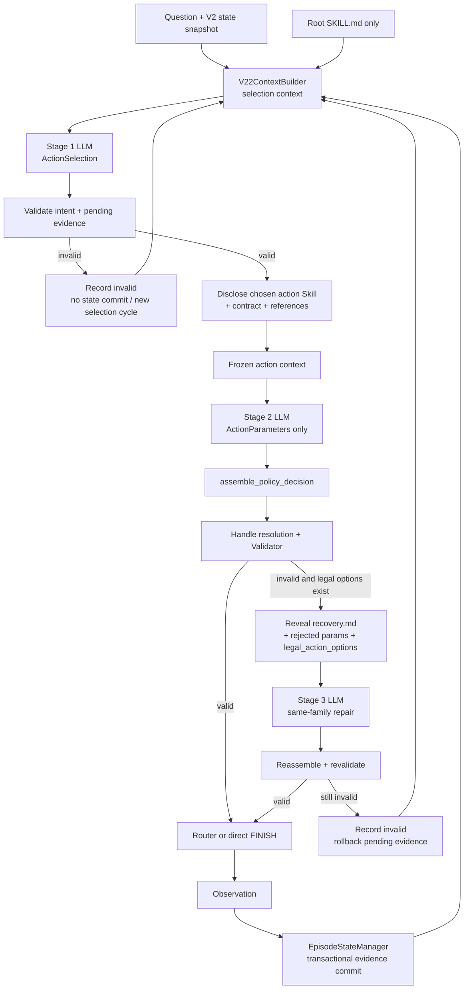

# V2.2 Progressive Skill Disclosure 技術報告

> 實作模式：`workflow_mode: single_agent_v2_2`
> V2.2 保留 V2 的累積 evidence、`E#/S#/C#` 與 environment，但把原本一次生成完整 `PolicyDecision` 拆成「先選 action family，再揭露該 action 的 Skill 並填參數」。文中的序列化資料為 representative examples。

## 1. 定位與演進原因

V2 的單次 Policy call 同時要求模型：

- 判斷還缺什麼事實；
- 選 SEARCH / EXPAND / READ / FINISH；
- 記住每個 action 的不同欄位與限制；
- 填入正確 handle、method/target、direction、evidence；
- 必要時直接回答。

V2.2 的假設是：把「策略選擇」與「參數執行」拆成兩個 structured calls，並只在 action 確定後揭露相對應的 procedure skill，可以降低同一 prompt 的跨 action 干擾，讓 Skill 更專注於 procedure。若 action draft 無效，第三個 call 固定同一 action family，只揭露 recovery 文件與 Validator 產生的合法選項，避免重新做高階策略選擇。

V2.2 不把 Controller 變成 retrieval policy：action family 仍由 LLM 選。Controller 只固定 stage 邊界、載入對應 Skill、組裝 decision、驗證與執行。

## 2. 高階流程



一個正常 action cycle 使用兩次 Policy call；只有 Stage 2 schema/validator 失敗且存在合法 recovery options 時才使用第三次 repair call。Selection、draft 與 repair 都綁定同一份 frozen state；repair 不能偷偷換 action family。

## 3. 模組責任與精確 I/O

| 模組 | High-level purpose | Input | Output |
|---|---|---|---|
| `AgentHarness` | 辨識 `single_agent_v2_2`，強制載入 file-backed `ProgressiveSkillBundle`，組裝 V2 state semantics 與 V2.2 controller path。 | config、Substrate、bundle root path、provider、question/scope | progressive runtime + episode artifacts |
| `ProgressiveSkillBundle` | 在任何 model call 前驗證 root 與四個 action pack；以相對路徑與 SHA-256 建立可重現 manifest。 | `skills/agentic-rag-v2-2/SKILL.md` | root document、SEARCH/EXPAND/READ/FINISH packs、bundle hash |
| Root strategy Skill | 教 Stage 1 辨識 information gap、選 action family 與 pending evidence；不提供參數。 | selection context | 僅影響 `ActionSelection` 策略 |
| `V22ContextBuilder.build_selection` | 只揭露 root Skill，建構高階決策 context。 | question、bundle、state、trajectory、scope | `V22BuiltContext`，response model 為 `ActionSelection` |
| Stage 1 Policy | 選 action family、用自然語意描述 intent、暫選 evidence。 | root Skill + frozen current state | `ActionSelection(action_type, action_intent, selected_evidence_refs)` |
| `DecisionValidator.validate_action_selection` | 檢查 intent 不能只用 handle 代替語意，並先驗證 pending evidence 的 visible/scope/eligibility。 | selection、state、scope | `EvidenceSelectionValidation`；不改 state |
| Action Skill Pack | 僅提供已選 action 的 procedure、parameter contract 與 supplemental references；recovery 文件延後到被拒後。 | selected action family | draft documents 或 recovery documents |
| `V22ContextBuilder.build_action` | 將 selection、同一 frozen state 與 action-specific Skill 組成參數 call；recovery 時再加 rejected params、error 與 legal options。 | question、bundle、selection、state、trajectory、recovery data | `V22BuiltContext` |
| Stage 2 Policy | 不再選 action，只輸出對應參數 model。 | action intent + action Skill + frozen state | `SearchParameters` / `ExpandParameters` / `ReadParameters` / `FinishParameters` |
| `assemble_policy_decision` | 將 selection 與 parameters 組成既有 `PolicyDecision`，以保持下游 runtime 穩定。 | `ActionSelection` + matching parameter object | `PolicyDecision`；FINISH => SUFFICIENT，其他 => INSUFFICIENT |
| `DecisionValidator.validate(..., enforce_semantic_handles=True)` | 除 V2 runtime 規則外，禁止 query/answer 用 `E#/S#/C#` 取代自然語意。 | assembled decision、state、scope | validation result |
| `LegalActionCatalog` | 僅在 draft 被拒時，依 Validator 同一組 predicates 列出該 action family 的 handle-safe options。 | action type、state、scope、pending evidence | `legal_action_options[]` |
| Stage 3 Policy | 維持 action family 與 intent，只修正 parameter object。 | rejected params、validator error、legal options、recovery docs、同一 frozen state | repaired action parameters |
| Controller | 串接 stages、計算 usage、組裝/驗證/執行；本身不保存 episode data。 | snapshots、stage outputs | `AttemptEvent` / terminal result |
| Router + retrieval environment | 與 V2 相同地執行合法 SEARCH/EXPAND/READ。 | stable-ID action | Observation |
| `EpisodeStateManager` / `StateUpdater` | 保留 V2 cumulative evidence，但只在整個 action cycle 有效時 commit Stage 1 pending evidence。 | AttemptEvent | updated state、stage-rich StepRecord |
| `EvidenceResolver` | FINISH 時解析累積 evidence 與當輪 evidence。 | refs、state、scope | resolved evidence |
| `ArtifactWriter` | 額外保存 `policy_stages`、每階段 messages/output/error/usage、disclosed paths/hashes 與 `skill_bundle.json`。 | V2.2 episode | logical I/O v3 trace、bundle artifact、V2.2 metrics |

## 4. Progressive Skill bundle

固定 bundle 根目錄為：

```text
skills/agentic-rag-v2-2/
├── SKILL.md
└── actions/
    ├── search/
    │   ├── SKILL.md
    │   └── references/{contract.md,recovery.md}
    ├── expand/
    │   ├── SKILL.md
    │   └── references/{contract.md,relations.md,recovery.md}
    ├── read/
    │   ├── SKILL.md
    │   └── references/{contract.md,recovery.md}
    └── finish/
        ├── SKILL.md
        └── references/{contract.md,evidence.md,recovery.md}
```

Draft call 只看 action 的 `SKILL.md + contract + supplemental references`；`recovery.md` 只在初稿被拒後揭露。Artifact 會保存所有 15 份文件的 bytes/hash，使每次實驗可確認真正使用的 procedure 版本。

## 5. Policy input / output contract

### 5.1 Stage 1：ActionSelection

Policy 看見的 current state 不包含逐 node capability catalog，而是語意化 visible handles：

```json
{
  "current_state": {
    "step": 0,
    "policy_attempts": 0,
    "accumulated_evidence": [],
    "visible_handles": [],
    "latest_observation": null,
    "attempted_actions": [],
    "budget": {
      "remaining_steps": 8,
      "remaining_policy_attempts": 10,
      "remaining_retrieved_tokens": 12000
    }
  }
}
```

Stage 1 output：

```json
{
  "action_type": "SEARCH",
  "action_intent": "No birthplace evidence is visible, so search for a sentence that states where Marie Curie was born.",
  "selected_evidence_refs": []
}
```

`action_intent` 必須描述真實名字與缺漏語意，不能只寫「expand E2」。這一階段禁止輸出 query、method、target、source、direction、chunk、answer 或 citations。

### 5.2 Stage 2：Action-specific parameters

選定 SEARCH 後，第二次 call 只允許：

```json
{
  "query": "Marie Curie birthplace Warsaw",
  "method": "BM25",
  "target": "SENTENCE",
  "top_k": 5
}
```

四種 parameter contracts：

```json
{"query":"...","method":"BM25","target":"SENTENCE","top_k":5}
```

```json
{"kind":"SENTENCE_MENTIONS_ENTITY","source_id":"S1","direction":null,"query":null,"top_k":5}
```

```json
{"chunk_id":"C1"}
```

```json
{"answer":"Warsaw","evidence_refs":[{"unit":"SENTENCE","id":"S1"}]}
```

Controller 組裝 SEARCH selection + parameters 後的 internal stable contract：

```json
{
  "assessment": {
    "status": "INSUFFICIENT",
    "supported_facts": [],
    "missing_information": [
      "No birthplace evidence is visible, so search for a sentence that states where Marie Curie was born."
    ],
    "selected_evidence_refs": []
  },
  "action": {
    "type":"SEARCH",
    "query":"Marie Curie birthplace Warsaw",
    "method":"BM25",
    "target":"SENTENCE",
    "top_k":5
  }
}
```

### 5.3 Stage 3：同 action family repair

若 Stage 2 錯選非法 pair：

```json
{"query":"Marie Curie birthplace","method":"LEXICAL","target":"SENTENCE","top_k":5}
```

repair context 才新增：

```json
{
  "rejected_parameters": {
    "query":"Marie Curie birthplace",
    "method":"LEXICAL",
    "target":"SENTENCE",
    "top_k":5
  },
  "validation_error": {
    "code":"invalid_action_parameters_response",
    "message":"unsupported retrieval pair"
  },
  "legal_action_options": [
    {"method":"LEXICAL","target":"ENTITY","top_k":5},
    {"method":"BM25","target":"SENTENCE","top_k":5},
    {"method":"BM25","target":"CHUNK","top_k":5},
    {"method":"DENSE","target":"ENTITY","top_k":5},
    {"method":"DENSE","target":"SENTENCE","top_k":5},
    {"method":"DENSE","target":"CHUNK","top_k":5}
  ]
}
```

第三次 call 只能輸出修正後的 SEARCH parameters，不能改為 READ 或 FINISH。

## 6. Representative two-cycle trajectory

題目：`Where was Marie Curie born?`

### Cycle 1：SEARCH

1. Stage 1 回傳上面的 SEARCH selection。
2. Stage 2 回傳 BM25→SENTENCE parameters。
3. Router Observation：

```json
{
  "action_id":"attempt-1",
  "status":"OK",
  "results":[
    {
      "sentence_id":"sentence:marie-born",
      "text":"Marie Curie was born in Warsaw.",
      "parent_chunk_id":"chunk:marie-0",
      "document_id":"document:marie-curie",
      "title":"Marie Curie"
    }
  ],
  "retrieved_tokens":8
}
```

下一輪 `visible_handles` 由 state/projection 產生完整語意，不只給編號：

```json
[
  {
    "node_type":"SENTENCE",
    "handle":"S1",
    "text":"Marie Curie was born in Warsaw.",
    "title":"Marie Curie",
    "parent_chunk":"C1",
    "completeness":"COMPLETE"
  },
  {
    "node_type":"CHUNK",
    "handle":"C1",
    "title":"Marie Curie",
    "read_state":"UNREAD",
    "text":null,
    "previews":[]
  }
]
```

### Cycle 2：FINISH

Stage 1：

```json
{
  "action_type":"FINISH",
  "action_intent":"The complete sentence states that Marie Curie was born in Warsaw, so the birthplace question can be answered.",
  "selected_evidence_refs":[{"unit":"SENTENCE","id":"S1"}]
}
```

Stage 2：

```json
{
  "answer":"Warsaw",
  "evidence_refs":[{"unit":"SENTENCE","id":"S1"}]
}
```

正常 trajectory 是 2 個 action cycles、4 個 policy calls、2 個 environment steps（SEARCH 與 FINISH），`answer_calls=0`。每個 `StepRecord.policy_stages` 各保存 selection 與 draft；若有 repair，該 cycle 多一個 third stage。

## 7. Validation、transaction 與 error

V2.2 先後有三層錯誤邊界：

| 邊界 | 常見 code | State / step 行為 |
|---|---|---|
| Stage 1 schema | `invalid_action_selection_response` | 不 commit assessment/evidence；不消耗 env step；新 selection cycle |
| Stage 1 semantic/evidence | `action_intent_uses_handle`、`selected_evidence_*` | pending evidence rollback；不消耗 step |
| Stage 2 schema/assembly | `invalid_action_parameters_response`、`invalid_action_parameters` | 若有 legal options，進 same-family repair |
| Stage 2 runtime validation | `unknown_handle`、`handle_type_mismatch`、`duplicate_action`、source/read/evidence errors、`semantic_field_uses_handle` | 若有 legal options，進 repair；否則整 cycle invalid |
| Repair schema/validation | `invalid_action_repair_response` 或原 validator code | pending evidence rollback；下一輪重新 selection |
| Provider transport/config | `policy_error` | terminal；保存已發生 stage usage/trace |

Transactional evidence 是 V2.2 的重要保證：Stage 1 選中的 evidence 是 pending 值；只有 assembled action 通過 validation 並完成該 attempt 後才交給 StateUpdater 累積。Draft 與 repair 都失敗時，state 的 evidence、step 與 retrieval tokens 保持 cycle 前狀態，但 policy attempt 與所有 LLM usage 仍被記錄。

`LegalActionCatalog` 僅用於 recovery，不會出現在初始 selection 或 draft prompt。它不看 ground truth，只從 enabled schema、visibility、scope、eligibility、read state 與 duplicate predicates 建立 options。

## 8. 相對 V2 的修改

| 面向 | V2 | V2.2 |
|---|---|---|
| 每個正常 action cycle | 1 次完整 `PolicyDecision` call | 2 次：action selection + action parameters |
| Skill disclosure | 每輪看同一份完整 Skill | 先看 root；確定 action 後才看該 action pack |
| Policy output | assessment + union action | Stage 1 `ActionSelection`；Stage 2 action-specific parameters |
| Invalid recovery | 下一輪重新生成完整 decision | 先固定 action family 做一次 parameter repair；失敗才重選 |
| Legal action options | 一般 context 有 allowed expansions | 只在 repair context 揭露該 family 的 executable options |
| Evidence commit | validated full decision 後累積 | Stage 1 pending evidence 交易式 commit/rollback |
| 語意欄位 | protocol 要求 semantic query | validator 額外拒絕以 handle 取代 intent/query/answer |
| State semantics | cumulative V2 state | 同 V2；不是 semantic-memory V3 |

## 9. 對應實作、設定與測試

V2.2-specific source：

- `src/agentic_rag/agent/v22_context.py`
- `src/agentic_rag/agent/skill.py` 的 `ProgressiveSkillBundle`、`ActionSkillPack`
- `src/agentic_rag/agent/models.py` 的 `ActionSelection`、四種 `*Parameters`、`PolicyStageRecord`、`assemble_policy_decision`
- `src/agentic_rag/agent/policy.py` 的 `action_parameters_model`
- `src/agentic_rag/agent/controller.py` 的 `_run_episode_v22`、stage/repair/budget-finalize paths
- `src/agentic_rag/agent/validator.py` 的 selection validation 與 `LegalActionCatalog`
- `src/agentic_rag/agent/harness.py` 的 bundle loading、stage trace 與 V2.2 metrics
- 共用 V2 runtime：`state_management.py`、`state.py`、`handle_resolution.py`、`router.py`、`evidence.py`

設定與 Skill bundle：

- `configs/agentic_hotpotqa_luna_v2_2.yaml`
- `configs/agentic_hotpotqa_qwen35_9b_v2_2.yaml`
- `skills/agentic-rag-v2-2/SKILL.md`
- `skills/agentic-rag-v2-2/actions/**`

主要 tests：

- `tests/test_single_agent_v22.py`
- `tests/test_v22_policy_stages.py`
- `tests/test_v22_legal_catalog.py`
- `tests/test_v22_skill_bundle.py`
- `tests/test_agent_harness_skill_content.py`（V2.2 file-backed 限制）
- `tests/test_single_agent_v2.py`（共享 state/runtime regression）

## 10. 已知限制

- 正常 action 就需要兩次 LLM call；在固定 20 題 pilot 中，這種 decomposition 可能提高 calls 與 tokens，即使每次 prompt 更專注。
- Stage 1 選錯 action family 時，Stage 2 與 repair 都不能換 action，只能完成/修正錯的 family；通常要等新 selection cycle 才能恢復。
- 仍使用 V2 的 opaque `E#/S#/C#`，所以 typed handle copy/type mismatch 問題並未根除。
- State 仍靠 assessment 的 `selected_evidence_refs` 累積，不是 V3 的所有 novel evidence 自動保存。
- Progressive bundle 必須是固定 file-backed layout；`AgentHarness.from_skill_content` 不支援 V2.2，因此不能直接把單一 in-memory SkillOpt candidate 當完整 bundle。
- Recovery catalog 能降低參數錯誤，但也讓 repair call 看見一組可執行 options；此時研究的是 constrained repair，不再是完全自由的 procedure generation。
- Root/action/recovery 三層文件增加實驗版本管理責任；必須使用 bundle hash 與 disclosed path trace 才能確保比較有效。
