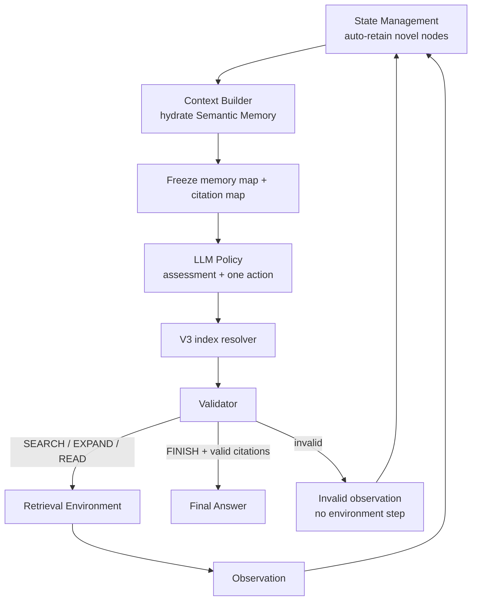

# V3：Semantic Memory + 分離式 Context Index

## 定位與演進原因

V3 是真正的 state representation redesign。V2 要 Policy 一邊找資料、一邊維護 `selected_evidence_refs`、理解 `E#/S#/C#` handle 能力；V3 改成 State Management 自動保存所有 novel nodes，Policy 直接閱讀完整語意內容，只需判斷「還缺什麼」與「下一步做什麼」。

V3 刻意把兩件事拆開：

- Semantic state：完整 Entity 名稱、Sentence 文字、Chunk preview／全文。
- Reference UI：EXPAND／READ 使用 memory index；FINISH 使用另一套 citation index。

SEARCH 不使用 index，而且在任何 state 下都與 EXPAND、READ、FINISH 平行存在。

實際 mode：`single_agent_v3`。

## 高階流程



## 模組與 Input / Output

| 模組 | High-level 描述 | Input | Output |
|---|---|---|---|
| `EpisodeStateManager` | 唯一 state owner；原子性保存 attempt、usage、budget 與 trajectory | `AttemptEvent`、前一 `ControllerState` | 更新後 snapshot、append-only `StepRecord` |
| `StateUpdater` | 去重並更新 first-seen node order、visibility、eligible sentence、read chunk 與 action signature | Observation、assessment、action signature | 下一個 `ControllerState` |
| `PolicyContextBuilder` | 從 substrate hydration 完整語意；折疊已被完整 chunk 涵蓋的 sentence | Question、Skill、snapshot、scope | `V3PolicyView`、messages、frozen `ContextReferenceMap` |
| V3 Policy provider | 根據完整語意 state 選下一個 action | messages + V3 structured schema | `V3PolicyDecision` |
| `resolve_v3_decision` | 只用同一 prompt 的 frozen maps 解 index | decision、memory map、citation map | stable-ID `PolicyDecision` 或 index/type error |
| `DecisionValidator` | 檢查 expansion node type、chunk readability、citation eligibility、duplicate 與 budget | resolved decision、snapshot | valid result／error code |
| `ActionRouter` | 執行合法 retrieval action | stable `SearchAction` / `ExpandAction` / `ReadAction` | 原始 Observation、retrieved tokens |
| `EvidenceResolver` | 將合法 citations 對應到完整 ground truth text | stable evidence refs | `ResolvedEvidence[]` |
| `AgentController` | 無狀態串接上述模組；合法 FINISH 時直接結束 | immutable snapshot、Policy decision | AttemptEvent 或 `EpisodeResult` |

Semantic Memory 並不是複製一份 corpus。內部 state 保存 stable node ID、first-seen order、visibility、read／eligible 狀態；Context Builder 每輪再從 substrate 取回文字。

## Policy Input Contract

代表性 Policy state：

```json
{
  "instruction": "Produce the next V3PolicyDecision.",
  "policy_state": {
    "step": 1,
    "policy_attempts": 1,
    "last_assessment": {
      "status": "INSUFFICIENT",
      "supported_facts": [],
      "missing_information": ["Need Marie Curie's birthplace."]
    },
    "semantic_memory": [
      {
        "context_index": 1,
        "node_type": "SENTENCE",
        "citation_index": 1,
        "title": "Marie Curie",
        "text": "Marie Curie was born in Warsaw.",
        "parent_chunk_context_index": 2
      },
      {
        "context_index": 2,
        "node_type": "CHUNK",
        "citation_index": null,
        "title": "Marie Curie",
        "chunk_position": 0,
        "has_been_read": false,
        "text": null,
        "previews": []
      }
    ],
    "latest_event": {
      "action_id": "attempt-1",
      "outcome": "success",
      "usage": {"retrieved_tokens": 8},
      "error": null
    },
    "attempted_actions": [
      {
        "policy_attempt": 1,
        "action": {
          "type": "SEARCH",
          "method": "BM25",
          "target": "SENTENCE",
          "query": "Where was Marie Curie born?"
        },
        "outcome": "success"
      }
    ],
    "budget": {
      "remaining_steps": 9,
      "remaining_policy_attempts": 11,
      "remaining_retrieved_tokens": 11992
    }
  }
}
```

Policy 不會看到 stable corpus ID、V2 的 selected evidence、Action Targets、allowed expansions 或 handle capability table。

## Policy Output Contract

Assessment 只陳述判斷，不再決定哪些 evidence 應保留：

```json
{
  "assessment": {
    "status": "SUFFICIENT",
    "supported_facts": ["Marie Curie was born in Warsaw."],
    "missing_information": []
  },
  "action": {
    "type": "FINISH",
    "answer": "Warsaw",
    "citations": [1]
  }
}
```

EXPAND／READ／SEARCH 的代表性輸出：

```json
{
  "type": "EXPAND",
  "kind": "SENTENCE_MENTIONS_ENTITY",
  "source_context_index": 1,
  "direction": null,
  "query": null,
  "top_k": 5
}
```

```json
{"type": "READ", "chunk_context_index": 2}
```

```json
{
  "type": "SEARCH",
  "query": "Where was Marie Curie born?",
  "method": "BM25",
  "target": "SENTENCE",
  "top_k": 5
}
```

## Reference 與 Snapshot 規則

每個 Policy prompt 同時建立並 freeze：

```text
Memory map
1 → stable sentence ID
2 → stable chunk ID

Citation map
1 → stable sentence ID
```

- EXPAND／READ 只解析 memory map。
- FINISH 只解析 citation map。
- 同一數字在兩個 namespace 中可以指不同用途，不能交叉解析。
- Policy 回覆後 Controller 必須沿用該 prompt 的 map，不能重新 build。
- 下一輪 context 可以重新編號；舊 mapping 只留在 audit artifact。
- complete sentence 與已 READ chunk 才有 citation；Entity、preview、unread chunk 沒有。

## Observation 與 State Transition 實例

Environment 只回傳環境事實與實際 retrieval usage：

```json
{
  "action_id": "attempt-1",
  "action": {
    "type": "SEARCH",
    "query": "Where was Marie Curie born?",
    "method": "BM25",
    "target": "SENTENCE",
    "top_k": 5
  },
  "outcome": "success",
  "results": [
    {
      "target": "SENTENCE",
      "title": "Marie Curie",
      "text": "Marie Curie was born in Warsaw."
    }
  ],
  "usage": {"retrieved_tokens": 8},
  "error": null
}
```

State Management 再計算 novel／seen、visibility、evidence eligibility、budget 與 episode-local display mapping。這些 derived 欄位不由 Retriever 宣稱。

## Chunk Folding

未讀 chunk 顯示 title、position、preview 與 memory index。READ 後：

1. chunk 顯示全文並取得 citation index；
2. 已被全文涵蓋的 sentences 從下一輪 Policy context 移除，避免重複；
3. 被折疊的 sentence 仍保存在 internal state 與 trajectory；
4. 下一輪 frozen maps 只包含仍可見 items。

## Validation 與錯誤

| Error | 意義 | 是否執行 retrieval／扣 step |
|---|---|---|
| `memory_index_out_of_range` | memory index 不在當輪 map | 否 |
| `citation_index_out_of_range` | citation 不在當輪 citation map | 否 |
| `memory_node_type_mismatch` | action kind 需要的 node type 不符 | 否 |
| `chunk_not_readable` | READ 指到非 chunk、已讀或不可讀 chunk | 否 |
| `expansion_not_valid_for_node` | 該關係不能從指定節點走 | 否 |
| `duplicate_action` | exact structured action 已嘗試 | 否 |

Invalid 仍會消耗一次 Policy attempt 並留下 raw decision、frozen maps、validation error 與 state transition audit，但不消耗 environment step，也不產生 retrieved tokens。

## 相對 V2 的改變

| 維度 | V2 | V3 |
|---|---|---|
| Evidence retention | Policy selection，Controller 累積 | State Management 自動保存 novel evidence |
| Policy state | handles + capability + selected evidence | 完整 Semantic Memory |
| Assessment | 包含 `selected_evidence_refs` | 只包含 supported/missing facts |
| References | episode-stable `E#/S#/C#` | context-local memory/citation indices |
| Chunk display | handle/read-state 為主 | unread preview；read full text；sentence folding |
| SEARCH | schema 可用但容易被 targets UI 影響 | 明確 unrestricted、無需 index |

## 已知限制與 Pilot 訊號

- Luna 在 Resample-20 的 V3 A/B/C aggregate 為 `54/60`，V2 為 `52/60`；V3 tokens 少 `25.8%`。
- Qwen V3 只有 `13/60`，invalid `454`；問題從 V2 的 unknown handle 轉成 wrong index/type、unread chunk 與 duplicate action。
- 因此 Semantic Memory 對強模型是較乾淨且有效率的表示，但它本身不保證 9B 模型能可靠操作結構化 action。

## 實作索引

- Context／protocol：`src/agentic_rag/agent/context.py`
- Models：`src/agentic_rag/agent/models.py`
- Frozen-map resolver：`src/agentic_rag/agent/context_resolution.py`
- State owner：`src/agentic_rag/agent/state_management.py`
- Controller：`src/agentic_rag/agent/controller.py`
- Config：`configs/agentic_hotpotqa_luna_v3.yaml`、`configs/agentic_hotpotqa_qwen35_9b_v3.yaml`
- Tests：`tests/test_single_agent_v3.py`
