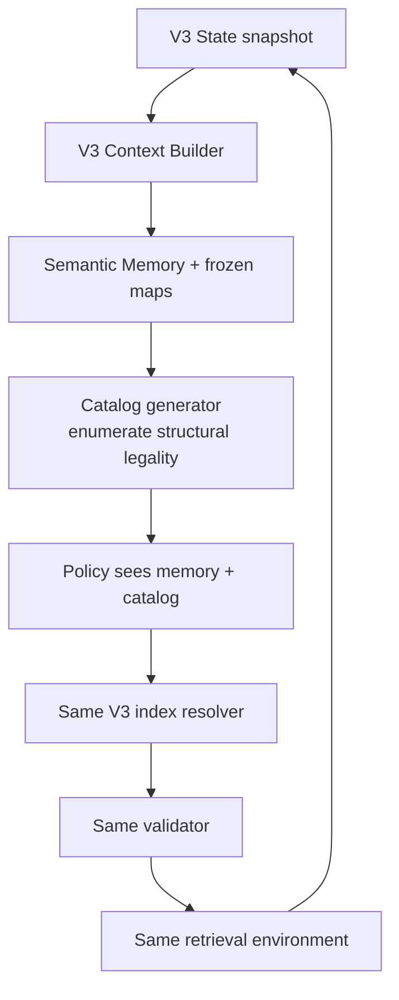

# V3 Action Catalog：合法 Action 顯示 Ablation

## 定位

V3 Action Catalog 不是新 state semantics，也不是 V3 的必然 successor；它是一個介面 variation，用來回答：如果每輪把「結構上可執行的 action」明列給 Policy，會降低 invalid，還是會讓模型被現有 targets 限縮而減少再次 SEARCH？

實際 mode：`single_agent_v3_action_catalog`。

它完整保留 V3 的 Semantic Memory、雙 index、frozen maps、retriever、budget、Skill 與 Controller，只在 Context Builder 增加 `valid_action_catalog`。

## 高階流程



## 模組與 Input / Output

| 模組 | High-level 描述 | Input | Output |
|---|---|---|---|
| V3 State Management | 與 V3 相同，自動保存 novel memory | Observation、assessment、usage | snapshot、trajectory |
| V3 Context Builder | 建 Semantic Memory 與雙 frozen maps | snapshot、substrate | `V3PolicyView`、memory/citation maps |
| Catalog generator | 列出當輪所有 structurally executable templates | frozen maps、enabled expansions、read state | `valid_action_catalog` |
| Policy LLM | 同時看語意 state 與合法 template | V3 messages + catalog + schema | 原版 `V3PolicyDecision` |
| Resolver／Validator／Router | 完全沿用 V3 | decision + frozen maps + state | resolved action／Observation／error |

這版沒有新增 decision model；output wire contract 與 V3 相同。

## 額外 Policy Input 實例

```json
{
  "valid_action_catalog": {
    "SEARCH": [
      {"type": "SEARCH", "method": "LEXICAL", "target": "ENTITY", "top_k": 5},
      {"type": "SEARCH", "method": "BM25", "target": "SENTENCE", "top_k": 5},
      {"type": "SEARCH", "method": "BM25", "target": "CHUNK", "top_k": 5},
      {"type": "SEARCH", "method": "DENSE", "target": "ENTITY", "top_k": 5},
      {"type": "SEARCH", "method": "DENSE", "target": "SENTENCE", "top_k": 5},
      {"type": "SEARCH", "method": "DENSE", "target": "CHUNK", "top_k": 5}
    ],
    "EXPAND": [
      {
        "type": "EXPAND",
        "kind": "SENTENCE_MENTIONS_ENTITY",
        "source_context_index": 1,
        "direction": null,
        "top_k": 5
      },
      {
        "type": "EXPAND",
        "kind": "CHUNK_ADJACENT_CHUNK",
        "source_context_index": 2,
        "valid_directions": ["PREV", "NEXT", "BOTH"],
        "top_k": 5
      }
    ],
    "READ": [
      {"type": "READ", "chunk_context_index": 2}
    ],
    "FINISH": [
      {"type": "FINISH", "available_citation_indices": [1]}
    ]
  }
}
```

即使 Semantic Memory 是空的，六種 SEARCH method/target 仍全部存在，避免因已有或沒有節點而從 schema 移除搜尋能力。

## Policy Output 實例

Policy 仍需自己寫 query／answer，catalog 不代替策略判斷：

```json
{
  "assessment": {
    "status": "UNCERTAIN",
    "supported_facts": ["Marie Curie was born in Warsaw."],
    "missing_information": ["Need an independent sentence if the comparison requires a second subject."]
  },
  "action": {
    "type": "SEARCH",
    "query": "Where was the second scientist born?",
    "method": "BM25",
    "target": "SENTENCE",
    "top_k": 5
  }
}
```

## Catalog 的語意邊界

Catalog 表示「可執行」，不是「應該做」：

- listed EXPAND source 的 node type 合法，不代表該鄰居包含答案；
- listed READ target 尚未讀，不代表值得閱讀；
- FINISH 出現只代表至少有 citation，不代表 evidence 足夠；
- SEARCH query 是開放文字，無法被完整列舉；
- duplicate action 依 query 與完整 structured signature 判斷，因此也無法預先全列。

## Validation 與 State

所有 validation、error code、invalid accounting、chunk folding 與 automatic semantic-memory retention 都與 V3 完全相同。Catalog 由同一個 frozen snapshot 產生，所以 catalog index 與 resolver map 保持一致；Policy 回覆後不能重建。

## 與 V3 Baseline 的唯一實作差異

| 維度 | V3 | V3 + Catalog |
|---|---|---|
| Semantic Memory | 相同 | 相同 |
| Policy schema | 相同 | 相同 |
| Reference | 雙 index | 雙 index |
| State retention | 自動 | 自動 |
| 額外 context | 無 | `valid_action_catalog` |
| SEARCH availability | 永遠存在 | 永遠列出六種 template |

## Pilot 結果與解讀

固定 Resample-20、Luna、B/C Skills：

| Scope | Baseline V3 | V3 + Catalog | 差異 |
|---|---:|---:|---:|
| Judge correct | 37/40 | 38/40 | +1 |
| Invalid | 1 | 0 | -1 |
| Policy calls | 191 | 177 | -14 |
| Total tokens | 695,906 | 754,733 | +8.5% |
| SEARCH | 108 | 94 | -14 |
| EXPAND | 7 | 4 | -3 |
| READ | 36 | 39 | +3 |

Skill C 單獨由 `19/20` 到 `20/20`，但 catalog 使每次 prompt 更長。SEARCH／EXPAND 減少而 READ 增加，證明你擔心的 scope effect 確實存在；單次多一題正確不能證明 catalog 因果上更好。

## 適合如何使用

- 適合作為 action affordance ablation 與 debugging interface。
- 不應直接併回 V3 baseline，因為它同時改變 token 成本與探索行為。
- 若要研究「看見所有合法 action」是否有效，應重複多 seeds／runs，並觀察 observation 後再次 SEARCH、no-progress 後 SEARCH 與 catalog item 選擇率。

## 實作索引

- Catalog 建構與 protocol：`src/agentic_rag/agent/context.py`
- Workflow wiring：`src/agentic_rag/agent/harness.py`
- Config：`configs/agentic_hotpotqa_luna_v3_action_catalog.yaml`
- Tests：`tests/test_v3_action_catalog.py`
- Pilot：`reports/hotpotqa_v3_action_catalog_luna_20260805.md`
