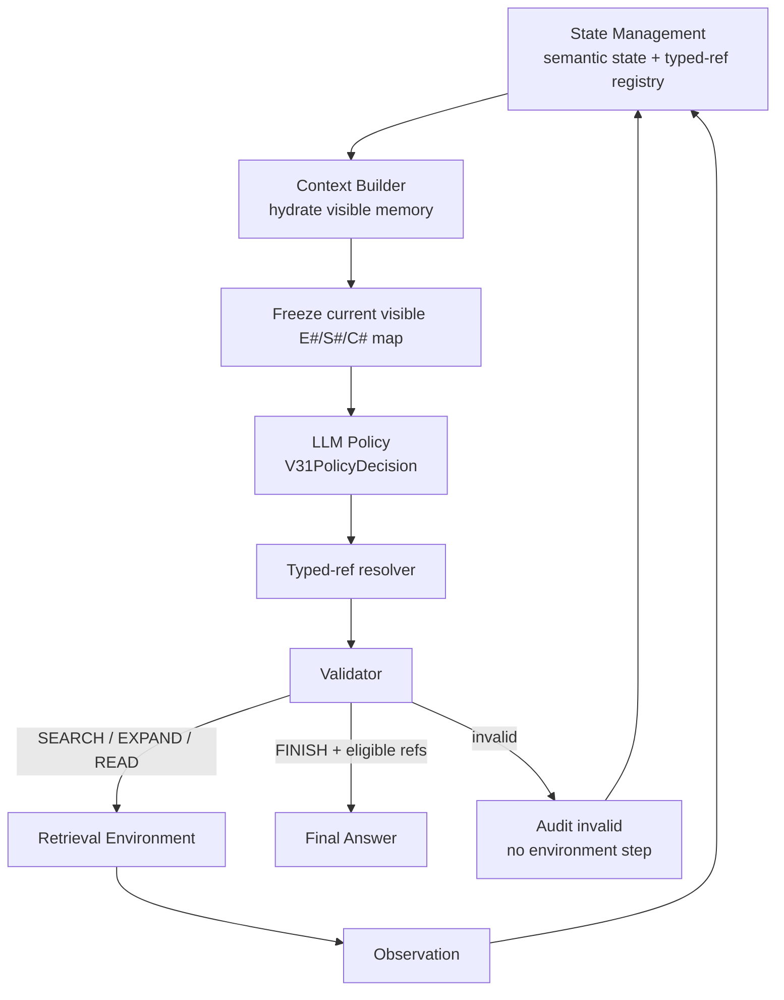

# V3.1：Semantic Memory + Typed References

## 定位與研究假設

V3.1 保留 V3 的 Semantic Memory、automatic evidence retention、chunk folding、retriever、budget 與單一 Agent，只替換 reference mechanism：

- V3：EXPAND/READ 用 memory index，FINISH 用 citation index。
- V3.1：全部使用一套題內穩定的 `E#/S#/C#` typed refs。

研究目的是隔離「模型看到的完整語意內容」與「如何引用看到的內容」兩個因素，判斷雙 index 是否是主要錯誤來源。

實際 mode：`single_agent_v3_typed_refs`。

## 高階流程



## 模組與 Input / Output

| 模組 | High-level 描述 | Input | Output |
|---|---|---|---|
| `NodeHandleRegistry`（State 內） | 同一 stable node 第一次出現時配發題內穩定 typed ref | stable node ID、node type | `E1`／`S1`／`C1`；bidirectional mapping |
| State Management | 保存 registry、semantic visibility、evidence/read state、history 與 budget | AttemptEvent | immutable snapshot + trajectory |
| V3.1 Context Builder | 顯示完整語意與 refs；只收集當輪可見 refs | snapshot、substrate | `V31PolicyView`、frozen `TypedContextReferenceMap` |
| V3.1 Policy provider | 在 SEARCH／EXPAND／READ／FINISH 中選一個 | messages + typed-ref schema | `V31PolicyDecision` |
| `resolve_v31_decision` | 正規化大小寫／空白後，在當輪 frozen map 解析 | decision、typed map | stable-ID internal decision 或 reference error |
| Validator | 檢查 source type、readability、evidence eligibility、duplicate | resolved decision、snapshot | valid／明確 error |
| Controller／Router／StateUpdater | 與 V3 相同 | decision／Observation | action result、new state |

Controller 不保存 registry；registry 是 `ControllerState` 的一部分，由 State Management 擁有。Context Builder 建本輪可見 map，Controller 只消費它。

## Policy Input Contract

```json
{
  "instruction": "Produce the next V31PolicyDecision.",
  "policy_state": {
    "step": 1,
    "policy_attempts": 1,
    "last_assessment": {
      "status": "INSUFFICIENT",
      "supported_facts": [],
      "missing_information": ["Need Marie Curie's birthplace."]
    },
    "semantic_memory": [
      {
        "ref": "S1",
        "node_type": "SENTENCE",
        "title": "Marie Curie",
        "text": "Marie Curie was born in Warsaw.",
        "parent_chunk_ref": "C1"
      },
      {
        "ref": "C1",
        "node_type": "CHUNK",
        "title": "Marie Curie",
        "chunk_position": 0,
        "has_been_read": false,
        "text": null,
        "previews": []
      }
    ],
    "latest_event": {
      "action_id": "attempt-1",
      "outcome": "success",
      "usage": {"retrieved_tokens": 8},
      "error": null
    },
    "attempted_actions": [],
    "budget": {
      "remaining_steps": 9,
      "remaining_policy_attempts": 11,
      "remaining_retrieved_tokens": 11992
    }
  }
}
```

Policy 看到 `S1` 的同時一定看到其 title/text/parent，所以 typed ref 只是操作 UI，不是語意 state 本身。

## Policy Output Contract

FINISH：

```json
{
  "assessment": {
    "status": "SUFFICIENT",
    "supported_facts": ["Marie Curie was born in Warsaw."],
    "missing_information": []
  },
  "action": {
    "type": "FINISH",
    "answer": "Warsaw",
    "evidence_refs": ["S1"]
  }
}
```

EXPAND／READ：

```json
{
  "type": "EXPAND",
  "kind": "SENTENCE_MENTIONS_ENTITY",
  "source_ref": "S1",
  "direction": null,
  "query": null,
  "top_k": 5
}
```

```json
{"type": "READ", "chunk_ref": "C1"}
```

SEARCH 與 V3 完全相同且不使用 reference。

## Typed Reference 規則

- `E#` = Entity；`S#` = complete Sentence；`C#` = Chunk。
- ref 在整個 episode 內穩定，同一 node 不重新編號。
- **能否解析仍以當輪 frozen visibility 為準**；registry 中存在但本輪被 folding 隱藏的 ref 不接受。
- 只做無害正規化：`" s1 "` 會變成 `"S1"`。
- 不做 fuzzy matching、不猜最接近的數字、不做 graph-handle repair。
- EXPAND source type 必須符合 expansion kind。
- READ 只能用目前顯示且 unread 的 `C#`。
- FINISH evidence 只能是目前顯示的 `S#` 或已 READ 的 `C#`；`E#` 和 unread `C#` 不合格。

## Frozen Visibility 實例

第一輪顯示 `S1` 與 `C1`；READ `C1` 後，完整 chunk 涵蓋 `S1`，所以下一輪只顯示 read `C1`。Registry 仍記得 `S1`，舊 audit map 也保留，但 Policy 若在下一輪 FINISH 引用 `S1`，Controller 會回：

```json
{
  "action_id": "attempt-3",
  "outcome": "invalid_action",
  "results": [],
  "usage": {"retrieved_tokens": 0},
  "error": {
    "code": "reference_not_available",
    "message": "Reference S1 is not visible in this Policy snapshot.",
    "retryable": true
  }
}
```

正確做法是引用本輪顯示且已讀的 `C1`。

## Validation Errors

| Error | 例子 |
|---|---|
| `reference_not_available` | invent `E9`，或引用已被 folding 隱藏的舊 `S1` |
| `reference_type_mismatch` | READ 使用 `S1`；某 expansion 要 Entity 卻使用 `C1` |
| `reference_not_evidence` | FINISH 使用 `E1` 或 unread `C1` |
| `chunk_not_readable` | chunk 已讀或當前不可讀 |
| `expansion_not_valid_for_node` | node type 正確但該 graph relation 不成立／未啟用 |
| `duplicate_action` | 完整 structured action 重複 |

所有 invalid 都保存 raw decision、frozen map、error 與 policy usage；不執行 retrieval、不扣 environment step。

## 與 V2 Typed Handles 的本質差異

外觀看起來兩者都有 `E#/S#/C#`，但 state semantics 不同：

| 維度 | V2 | V3.1 |
|---|---|---|
| State content | handle capabilities、selected/latest evidence | 完整 Semantic Memory |
| Evidence retention | Policy 選擇，Controller 累積 | State Management 自動保存 |
| Assessment | 含 `selected_evidence_refs` | 不選 evidence |
| Reference visibility | persistent actionable handles | episode-stable ref，但只解析本輪 visible map |
| Chunk folding | 無 V3 folding | 有 |
| Allowed actions UI | detailed/minimal legality map | 無 Action Catalog；SEARCH 始終平行 |

所以「把 V3 改成 S#/E#/C#」不等於退回 V2；真正研究變因仍是 Semantic Memory。

## Pilot 結果

### Luna C

| Version | Judge | Invalid/reference errors | Calls | Total tokens |
|---|---:|---:|---:|---:|
| V3-C | 19/20 | 0 | 93 | 339,476 |
| V3.1-C | 19/20 | 0 | 90 | 328,659 |

Luna 能穩定複製合法 typed refs，品質持平、token 小幅下降。

### Qwen A/B/C Aggregate

| Version | Judge | Finished | Invalid | Reference errors | Calls | Total tokens |
|---|---:|---:|---:|---:|---:|---:|
| V3 | 13/60 | 14 | 454 | 241 | 619 | 1,726,718 |
| V3.1 | 4/60 | 6 | 517 | 278 | 662 | 1,815,749 |

V3.1 有 112 次 `reference_not_available`：12 次是曾可見但已 folding，100 次是模型發明；其中 93 次發生在 EXPAND。Typed prefix 對 Qwen 變成「可生成的 placeholder」，而不是 grounded pointer。結論是 reference UI 與 model capability 有強交互作用，不能用 Luna 結果推論 Qwen。

## 實作索引

- Wire models：`src/agentic_rag/agent/models.py`
- Context：`src/agentic_rag/agent/context.py`
- Resolver：`src/agentic_rag/agent/context_resolution.py`
- Registry/state：`src/agentic_rag/agent/models.py`、`src/agentic_rag/agent/state_management.py`
- Config：`configs/agentic_hotpotqa_luna_v3_typed_refs.yaml`、`configs/agentic_hotpotqa_qwen35_9b_v3_typed_refs.yaml`
- Tests：`tests/test_single_agent_v31.py`
- Reports：`reports/hotpotqa_v3_typed_refs_luna_c_20260806.md`、`reports/hotpotqa_v3_typed_refs_qwen_20260806.md`
