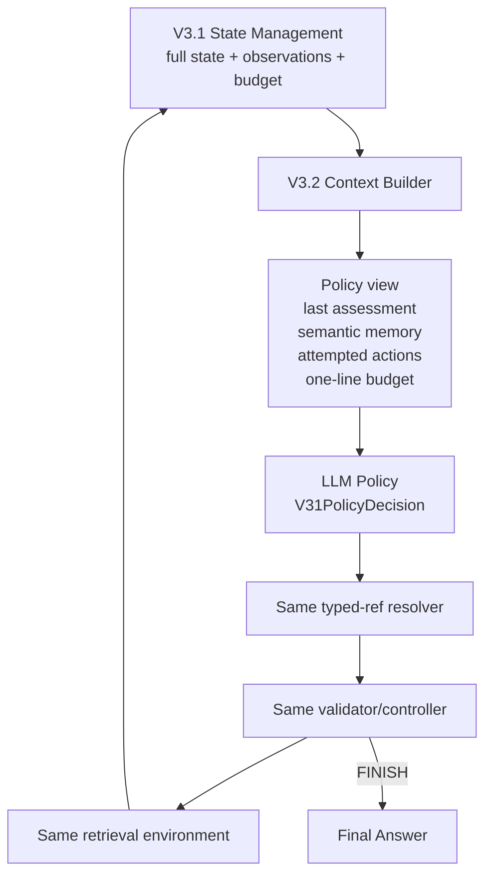

# V3.2：Typed References + Compact Policy State

## 定位

V3.2 是目前「奇異點之前」的最新正式 workflow mode。它完整沿用 V3.1 的 Semantic Memory、typed refs、frozen visibility、Controller、Validator、retriever 與 State Management，只精簡 Policy-visible state：

1. 移除 `latest_event`。
2. 保留 budget，但壓成單行：`Budget: 4 steps, 5 attempts, 3200 retrieval tokens left`。
3. 保留 `last_assessment` 與精簡 `attempted_actions`。

實際 mode：`single_agent_v3_2`。

這些改動只影響 Context Builder 的投影；完整 Observation、原始 budget、usage、trajectory 與 registry 仍存在 audit state。

## 高階流程



## 模組與 Input / Output

| 模組 | High-level 描述 | Input | Output | 與 V3.1 差異 |
|---|---|---|---|---|
| State Management | 保存完整 episode truth | AttemptEvent | full snapshot／trajectory | 無 |
| StateUpdater | 更新 semantic visibility、history、budget | prior state + Observation | next state | 無 |
| V3.2 Context Builder | 產生最小但保留控制訊號的 Policy projection | full snapshot、Question、Skill | V31 messages + frozen typed map | 不投影 `latest_event`；budget 轉單行 |
| Policy provider | 選一個 action | V3.2 context + V31 schema | `V31PolicyDecision` | schema 無差異 |
| Typed-ref resolver | 在 frozen visible refs 中解析 | decision + map | stable action／error | 無 |
| Validator／Router／Controller | 檢查並執行 action | stable action + state | Observation／EpisodeResult | 無 |
| Artifact Writer | 保存完整 trace | full EpisodeResult | JSON artifacts | 仍保留被 Policy 隱藏的 event/budget 細節 |

## Policy Input Contract

```json
{
  "instruction": "Produce the next V31PolicyDecision.",
  "policy_state": {
    "step": 6,
    "policy_attempts": 7,
    "last_assessment": {
      "status": "INSUFFICIENT",
      "supported_facts": ["Marie Curie was born in Warsaw."],
      "missing_information": ["Need the country containing Warsaw."]
    },
    "semantic_memory": [
      {
        "ref": "S1",
        "node_type": "SENTENCE",
        "title": "Marie Curie",
        "text": "Marie Curie was born in Warsaw.",
        "parent_chunk_ref": "C1"
      }
    ],
    "attempted_actions": [
      {
        "policy_attempt": 1,
        "action": {
          "type": "SEARCH",
          "method": "BM25",
          "target": "SENTENCE",
          "query": "Where was Marie Curie born?"
        },
        "outcome": "success",
        "error_code": null
      }
    ],
    "budget": "Budget: 4 steps, 5 attempts, 3200 retrieval tokens left"
  }
}
```

刻意不存在：

```json
{"latest_event": "..."}
```

## Policy Output Contract

與 V3.1 完全相同：

```json
{
  "assessment": {
    "status": "UNCERTAIN",
    "supported_facts": ["Marie Curie was born in Warsaw."],
    "missing_information": ["Need Warsaw's country."]
  },
  "action": {
    "type": "SEARCH",
    "query": "Warsaw is in which country?",
    "method": "BM25",
    "target": "SENTENCE",
    "top_k": 5
  }
}
```

FINISH 仍使用：

```json
{
  "type": "FINISH",
  "answer": "Poland",
  "evidence_refs": ["S1", "S2"]
}
```

EXPAND 使用 `source_ref`、READ 使用 `chunk_ref`。SEARCH 永遠不使用 ref。

## 為什麼拿掉 Latest Event

成功 retrieval 後，`latest_event` 的內容大多已出現在兩處：

- action／outcome 在 `attempted_actions`；
- results 的完整語意已 materialize 到 `semantic_memory`。

因此它常是重複輸入。V3.1 Luna-C one-factor ablation：

| Variant | Judge | Invalid | Calls | Total tokens | 相對 baseline |
|---|---:|---:|---:|---:|---:|
| V3.1 baseline | 19/20 | 0 | 90 | 328,659 | — |
| V3.1 −Latest event | 19/20 | 0 | 90 | 319,630 | −2.7% tokens |

有兩個相反方向的逐題 flip，淨 accuracy 不變。這表示它是最合理的優先移除候選，但單次 20 題不是統計因果證據。

## 為什麼保留 Attempted Actions

同一組 ablation 拿掉 history 後：

- invalid `0→4`，全部是 exact duplicate SEARCH；
- calls `90→101`；
- SEARCH `58→72`；
- no-progress 後 SEARCH `2→12`；
- total tokens 增加 `4.1%`。

Semantic Memory 告訴模型「目前知道什麼」，但不能完整告訴它「哪些 query/method 已做過」。因此精簡 history 是防止重複的機械性控制訊號，不是多餘介面。

## 為什麼保留 Last Assessment

移除 `last_assessment` 讓 calls 與 token 明顯下降，但 judge `19/20→18/20`。它讓 Policy 持續記得真正缺少的 fact，避免看到相關但不足的 evidence 就過早 FINISH。V3.2 因此保留。

## 為什麼 Budget 改成單行而非刪除

完全移除 budget 的 ablation 由 `19/20→18/20`，同時省 `17.1%` tokens。Policy 看不到剩餘空間時反而更早 FINISH。這是一個品質／成本 trade-off；V3.2 選擇保留控制訊號，但去掉 verbose structured serialization。

單行 budget 是新組合的一部分，尚未被單獨做 inference ablation。

## Observation 與 Audit

即使 Policy 不看 `latest_event`，Environment 仍回完整 Observation：

```json
{
  "action_id": "attempt-7",
  "outcome": "success",
  "results": [
    {"target": "SENTENCE", "title": "Warsaw", "text": "Warsaw is the capital of Poland."}
  ],
  "usage": {"retrieved_tokens": 9},
  "error": null
}
```

State Management 仍把它保存到 `StepRecord`、更新 usage/budget、將 novel sentence materialize 到下一輪 Semantic Memory。被 Context Builder 隱藏不等於資料被刪除。

## Validation 與 Reference

V3.2 完全沿用 V3.1：

- episode-stable `E#/S#/C#`；
- current-snapshot frozen visibility；
- trim/case normalization only；
- `reference_not_available`、`reference_type_mismatch`、`reference_not_evidence`；
- invalid 不執行 retrieval、不消耗 environment step，但消耗 Policy attempt 並保留 audit。

## 相對 V3.1 的差異邊界

| 維度 | V3.1 | V3.2 |
|---|---|---|
| Semantic Memory | 相同 | 相同 |
| Typed refs / frozen map | 相同 | 相同 |
| Policy action schema | 相同 | 相同 |
| State Management truth | 完整 | 完整 |
| Latest event 對 Policy | 顯示 | 不顯示 |
| Budget 對 Policy | structured object | 一行文字 |
| Attempted actions | 顯示 | 顯示 |
| Last assessment | 顯示 | 顯示 |

## 驗證狀態與重要限制

V3.2 已有 config、wiring 與 regression tests，針對：

- workflow mode 正確選到 typed-ref Context Builder；
- `latest_event_visible=false`；
- `node_reference_scheme=episode_local_typed_refs_with_frozen_visibility_v1`；
- 單行 budget；
- 其餘 V3/V3.1 regression 不變。

**截至本封存點，V3.2 尚未跑 Qwen 或 Luna 的完整 Resample-20 推論與 Judge。** V3.1 `−latest_event` 的結果不能標成 V3.2 成績，因為 V3.2 還同時引入未單獨測試的 compact budget serialization。

## 實作索引

- Config：`configs/agentic_hotpotqa_luna_v3_2.yaml`、`configs/agentic_hotpotqa_qwen35_9b_v3_2.yaml`
- Wiring：`src/agentic_rag/agent/harness.py`
- Context projection：`src/agentic_rag/agent/context.py`
- Tests：`tests/test_single_agent_v31.py`
- 設計依據：`reports/hotpotqa_v31_state_feature_ablation_luna_c_20260806.md`
