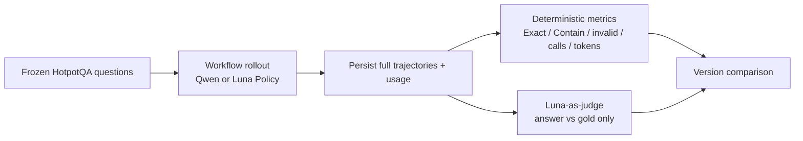

# Pilot 實驗總報告

## 實驗目的

這份報告把早期 Test-6 除錯、固定 Resample-20 主矩陣、A-RAG baseline、V2.2、V2 Compact、V3 Action Catalog、V3.1 typed refs 與 state-feature ablation 放在同一條版本演進脈絡中。

主要評估問題不是只看「答對幾題」，而是同時拆解：

1. 最終答案 correctness；
2. evidence acquisition 是否能持續進展；
3. Policy／Controller interface 是否產生 invalid；
4. 每題需要多少 calls、LLM tokens 與 retrieved tokens；
5. 不同 model × architecture × skill 是否有交互作用。

## 評估流程

## Resample-20 固定契約

- 20 題：16 bridge、4 comparison。
- Seed：`20260805`。
- Split SHA-256：`57fd2bf9871cd7fd310f5937810caa715539f55f7ffc8134103d0755865fec75`。
- 排除早期 Train-20、Val-6 與 Test-6，避免 post-hoc Skill C 污染主比較。
- 共用 substrate：`artifacts/hotpotqa_benchmark_exact`。
- V2/V3/V3.1/ablations：10 environment steps、12 policy attempts、12,000 retrieved-token budget。
- Policy models：Ollama `qwen3.5:9b` 與 OpenAI `gpt-5.6-luna`。
- Judge：`gpt-5.6-luna`，只看 generated answer 與 gold answer；空答案直接錯。

Judge 不看 question、retrieved evidence 或 citations，所以 Judge 量的是 final-answer semantic correctness，不是 evidence quality／citation entailment。

## 核心 V2 / V3 × Skill A/B/C 結果

| Model | Arch | Skill | Luna judge | Contain | Exact | Invalid | Calls | Total tokens | Retrieved | SEARCH | EXPAND | READ |
|---|---|---|---:|---:|---:|---:|---:|---:|---:|---:|---:|---:|
| Luna | V2 | A | 17/20 | 16 | 8 | 0 | 113 | 483,161 | 30,079 | 78 | 6 | 9 |
| Luna | V2 | B | 18/20 | 16 | 4 | 7 | 102 | 491,030 | 47,280 | 45 | 11 | 22 |
| Luna | V2 | C | 17/20 | 17 | 8 | 0 | 86 | 333,616 | 25,013 | 54 | 4 | 8 |
| Luna | V3 | A | 17/20 | 17 | 8 | 0 | 81 | 274,435 | 24,035 | 53 | 0 | 8 |
| Luna | V3 | B | 18/20 | 16 | 9 | 1 | 98 | 356,430 | 58,534 | 47 | 6 | 25 |
| Luna | V3 | C | **19/20** | 17 | **10** | 0 | 93 | 339,476 | 32,170 | 61 | 1 | 11 |
| Qwen | V2 | A | 5/20 | 3 | 1 | 109 | 202 | 741,957 | 32,178 | 143 | 26 | 18 |
| Qwen | V2 | B | 5/20 | 5 | 0 | 113 | 199 | 882,034 | 45,749 | 63 | 92 | 33 |
| Qwen | V2 | C | 4/20 | 4 | 0 | 103 | 196 | 703,781 | 27,251 | 104 | 75 | 11 |
| Qwen | V3 | A | **6/20** | **6** | 2 | 137 | 194 | 522,875 | 32,569 | 116 | 10 | 62 |
| Qwen | V3 | B | 3/20 | 2 | 0 | 174 | 228 | 677,806 | 43,456 | 63 | 59 | 89 |
| Qwen | V3 | C | 4/20 | 4 | **3** | 143 | 197 | 526,037 | 23,149 | 144 | 20 | 28 |

### Aggregate

| Model/version | Judge | Invalid | Calls | Total tokens | 相對同模型 V2 |
|---|---:|---:|---:|---:|---|
| Luna V2 A+B+C | 52/60 | 7 | 301 | 1,307,807 | baseline |
| Luna V3 A+B+C | 54/60 | 1 | 272 | 970,341 | +2 correct、−29 calls、−25.8% tokens |
| Qwen V2 A+B+C | 14/60 | 325 | 597 | 2,327,772 | baseline |
| Qwen V3 A+B+C | 13/60 | 454 | 619 | 1,726,718 | −1 correct、+22 calls、−25.8% tokens |

V3 對兩個模型都縮短總 token，但只有 Luna 同時改善正確率與 invalid。Qwen 的錯誤只是從 V2 handle 問題換成 V3 index/type/readability 問題。

## 最乾淨的 Luna + Skill C 版本鏈

這張表固定同一批 20 題與同一個 C skill family，最適合直觀比較介面演進；V2.2 使用另一個 progressive skill bundle，因此不放在這條 controlled chain。

| Version | Judge | Contain | Exact | Invalid | Ref err | Calls | Input | Output | Total | Retrieved |
|---|---:|---:|---:|---:|---:|---:|---:|---:|---:|---:|
| V2-C | 17/20 | 17 | 8 | 0 | 0 | 86 | 315,095 | 18,521 | 333,616 | 25,013 |
| V2 Compact-C | 18/20 | 17 | 9 | 1 | 0 | 86 | 295,198 | 19,786 | 314,984 | 24,140 |
| V3-C | 19/20 | 17 | 10 | 0 | 0 | 93 | 320,443 | 19,033 | 339,476 | 32,170 |
| V3 + Catalog-C | **20/20** | 19 | 14 | 0 | 0 | 83 | 336,356 | 15,663 | 352,019 | 35,428 |
| V3.1 typed refs-C | 19/20 | 17 | 9 | 0 | 0 | 90 | 310,729 | 17,930 | 328,659 | 31,235 |
| V3.1 −latest_event-C | 19/20 | 18 | 10 | 0 | 0 | 90 | 302,560 | 17,070 | 319,630 | 33,766 |
| V3.2 | **未跑** | — | — | — | — | — | — | — | — | — |

這條鏈不能簡化成「新版本一定更好」：Catalog accuracy 最高但 context/token 更重；typed refs 對 Luna 無 invalid，對 Qwen 卻嚴重退步；V3.2 尚無 inference 結果。

## V2 Compact

V2 Compact 只改 Context Builder，不改 V2 state semantics。

| Skill | V2 Judge / calls / tokens | Compact Judge / calls / tokens | 解讀 |
|---|---|---|---|
| B | 18/20 / 102 / 491,030 | 17/20 / 122 / 583,606 | prompt 略短但多 20 calls，總成本 +18.9% |
| C | 17/20 / 86 / 333,616 | 18/20 / 86 / 314,984 | calls 不變，總 token −5.6% |

B 與 C 合計 judge 都是 `35/40`；Compact calls `208` 高於 V2 的 `188`，tokens `898,590` 高於 `824,646`。介面壓縮會改變 trajectory，不是被動 byte saving。

只有 `runs/.../luna/v2_compact_valid/` 是有效結果；較早的 `v2_compact/` B 目錄是 0-call environment-key failure，已排除。

## V2.2 Progressive Skill

| Model | Judge | Contain | Exact | Blank | Invalid | Calls | Total tokens | Retrieved |
|---|---:|---:|---:|---:|---:|---:|---:|---:|
| V2.2 + Qwen | **10/20** | 7 | 2 | 5 | 54 | 270 | 620,359 | 8,595 |
| V2.2 + Luna | 16/20 | 16 | 6 | 0 | **0** | 196 | 596,735 | 22,106 |

V2.2 是所有內部 workflow 中 Qwen 最好的一版：先選 action family，再只揭露 action-specific skill，必要時第三次 call repair parameters。但相同 decomposition 對 Luna 既昂貴又只有 `16/20`。更多 procedure scaffolding 不是模型無關的優勢。

## A-RAG Reference

| System | Judge | Contain | Exact | Blank | Calls | LLM tokens | Retrieved |
|---|---:|---:|---:|---:|---:|---:|---:|
| A-RAG + Qwen | 6/20 | 6 | 0 | 13 | 81 | 217,831 | 53,854 |
| A-RAG + Luna | **19/20** | 17 | 0 | 0 | 75 | **173,408** | 48,634 |

A-RAG + Luna 與 Luna V3-C 同為 `19/20`，少 18 calls 與 166,068 reported LLM tokens。不過 A-RAG 是 native append-only tool history、10-loop/128k limit，prompt serialization、tool interface 與 provider accounting 都不同，不能把 token 比較宣稱為 strict apples-to-apples。

A-RAG + Qwen 沒有 Controller invalid，但有 13 題 blank；簡化 protocol 把 failure mode 從 validator rejection 轉成 termination/synthesis failure，沒有自動解決小模型問題。

## V3 Action Catalog

Luna B+C aggregate：

| Version | Judge | Invalid | Calls | Total tokens | SEARCH | EXPAND | READ |
|---|---:|---:|---:|---:|---:|---:|---:|
| V3 baseline | 37/40 | 1 | 191 | 695,906 | 108 | 7 | 36 |
| V3 + Catalog | 38/40 | 0 | 177 | 754,733 | 94 | 4 | 39 |

Catalog +1 correct、−14 calls、invalid 歸零，但總 token +8.5%。SEARCH／EXPAND 減少、READ 增加，是 action-target scope effect 的直接行為訊號。

## V3.1 Typed References

Luna-C 由 V3 的 `19/20, 339,476 tokens, 93 calls` 到 V3.1 的 `19/20, 328,659 tokens, 90 calls`；interface 可用且沒有 reference error。

Qwen A/B/C aggregate：

| Version | Judge | Finished | Invalid | Ref errors | Calls | Total tokens |
|---|---:|---:|---:|---:|---:|---:|
| V3 | 13/60 | 14 | 454 | 241 | 619 | 1,726,718 |
| V3.1 | 4/60 | 6 | 517 | 278 | 662 | 1,815,749 |

V3.1 的 112 次 `reference_not_available` 中，12 次是 folding 後 stale、100 次是 invented；93 次用於 EXPAND、19 次用於 FINISH。Typed prefix 讓 Qwen 學會 ref 的形狀，卻沒有保證它從當輪畫面 copy grounded target。

## V3.1 State Feature Ablation 與 V3.2 設計依據

固定 Luna-C：

| Variant | Judge | Invalid | Calls | Total tokens | 主要機制觀察 |
|---|---:|---:|---:|---:|---|
| Baseline | 19/20 | 0 | 90 | 328,659 | 全 state visible |
| −Last assessment | 18/20 | 0 | 83 | 277,765 | 少一題；missing-fact focus 可能有價值 |
| −Latest event | 19/20 | 0 | 90 | 319,630 | accuracy/calls 持平，−2.7% tokens |
| −Attempted actions | 19/20 | **4** | **101** | **342,063** | 四次 exact duplicate SEARCH |
| −Remaining budget | 18/20 | 0 | 80 | 272,608 | 省 17.1%，但更早 FINISH 且少一題 |

V3.2 因而保留 assessment、attempted actions 與 budget，移除 latest event，並把 budget 改成一行。但 `−latest_event` arm 不是完整 V3.2：它仍用 structured budget；V3.2 compact budget 尚未跑。

## 早期 Test-6 演進（僅 chronology）

| Stage | Contain | Exact | Invalid | Repairs | Calls | LLM tokens | Retrieved |
|---|---:|---:|---:|---:|---:|---:|---:|
| Prior Agentic RAG | 2/6 | 1/6 | 未在 primary summary 找到 | — | 42 | 135,001 | 9,866 |
| Optimized legacy | 2/6 | 2/6 | 10 | 7 | 33 | 94,918 | 7,439 |
| A-RAG native append-only | 6/6 | 6/6 | n/a | n/a | 28 | 119,361 | 21,173 |
| Single-Agent V2 Qwen | 2/6 | 1/6 | 26 | 2 | 47 | 193,339 | 11,828 |
| Single-Agent V2 Luna | 5/6 | 2/6 | 0 | 0 | 24 | 94,092 | 5,953 |
| Dev V3 Qwen standard | 3/6 | 2/6 | 35 | 3 | 53 | 147,843 | 9,403 |
| Dev V3 Qwen dynamic | 3/6 | 1/6 | 18 | 4 | 47 | 157,395 | 23,650 |

這張表只解釋版本為什麼演進，不能當 held-out model comparison：Test-6 Skill C 是看過 failures／GT 後寫的 post-hoc skill；第 4 題還有 official gold `Loca` 與 supporting evidence/tour `Loco` 的 annotation defect。

## 實驗覆蓋矩陣

| Version | Qwen | Luna | Skills／範圍 |
|---|---|---|---|
| V2 | 有 | 有 | Test-6 + Resample-20；A/B/C |
| V2 Compact | 無 | 有 | Resample-20；B/C only |
| V2.2 | 有 | 有 | Resample-20；既有 progressive bundle，不是 A/B/C |
| V3 | 有 | 有 | Test-6 + Resample-20；A/B/C |
| V3 Action Catalog | 無 | 有 | Resample-20；B/C only |
| V3.1 | A/B/C | C only | Resample-20 |
| V3.1 state ablations | 無 | C only | 四個 one-factor arms |
| V3.2 | **未跑** | **未跑** | implementation/config/tests only |
| A-RAG | 有 | 有 | Resample-20 native tools；另有 Test-6 |

## 如何解讀 Metrics

- Luna judge：主答案 correctness metric，但只看 answer/GT。
- Exact：對標點、alias、完整句過於嚴格，常低估正確。
- Contain：comparison 題可能同時提到兩個候選而誤算對。
- Invalid：衡量 policy/controller interface；A-RAG 沒有同型 validator，不能填 0，應填 n/a。
- Calls：V2.2 一 action 正常兩 calls，A-RAG tool loop 的 call semantics 也不同。
- Tokens：可看成本量級；跨 provider adapter／serialization 不宜作精確因果比較。
- Retrieved tokens：Environment 真正回傳給 agent 的內容量，不等於 LLM context length。

## 結論

1. 強模型 Luna 最適合 V3 semantic state；C procedure 在 baseline 達 `19/20`，整體 V3 同時比 V2 準確且省 token。
2. 小模型 Qwen 的主要瓶頸不是單一 reference 格式；它同時有 grounding、action parameterization、duplicate recovery 與 termination 問題。
3. V2.2 顯示 progressive action skill 能顯著幫 Qwen，但代價是 calls；對 Luna 反而不划算。
4. Action Catalog 可降低 mechanical invalid/calls，但會提高 context 成本並改變 SEARCH propensity。
5. `attempted_actions` 是有機械證據支持的必要 state；`latest_event` 是最合理的冗餘移除候選。
6. 下一個正式結論必須先跑 V3.2 固定 Resample-20（至少 Luna-C，再視成本跑 Qwen），不能以設計推論成績。

## Primary Artifacts

- 主矩陣：`reports/hotpotqa_resample20_matrix_20260805.md`
- V2 Compact：`reports/hotpotqa_v2_compact_luna_20260805.md`
- V3 Catalog：`reports/hotpotqa_v3_action_catalog_luna_20260805.md`
- V3.1 Luna-C：`reports/hotpotqa_v3_typed_refs_luna_c_20260806.md`
- V3.1 Qwen：`reports/hotpotqa_v3_typed_refs_qwen_20260806.md`
- State ablation：`reports/hotpotqa_v31_state_feature_ablation_luna_c_20260806.md`
- Persisted summaries：`runs/hotpotqa_resample20_seed20260805/`（raw runs 由 `.gitignore` 排除）

## 限制

- 每個 arm 是單次 20 題；Luna trajectory 非完全 deterministic，1 題 flip 不足以宣稱統計因果。
- Judge 不評 evidence quality、citation entailment 或是否走對 retrieval path。
- A-RAG、V2.2 與 V2/V3 的 call/token accounting 不完全同義。
- Test-6 是除錯歷史，不是可靠 held-out 結論；主結論應以明確排除舊題的 Resample-20 為準。
