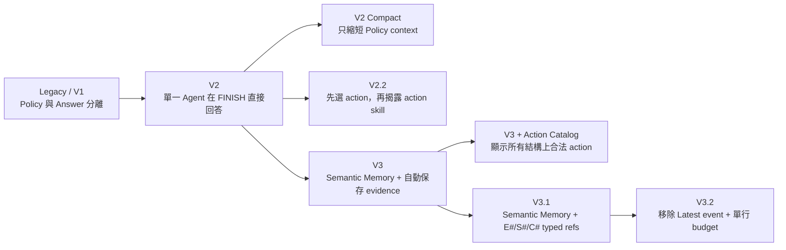
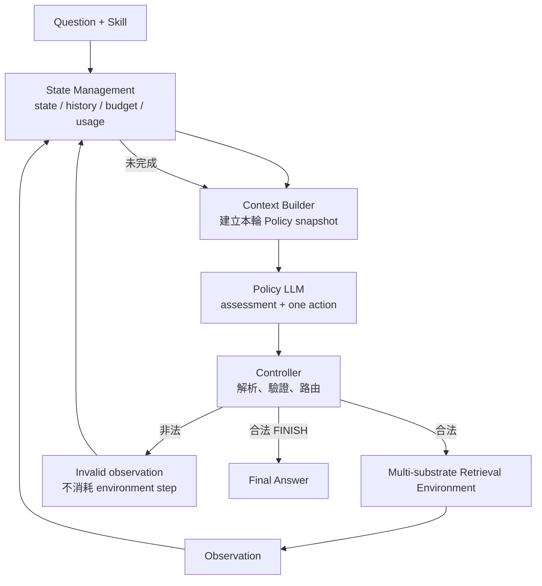

# Agentic RAG 版本演進總覽：奇異點之前

> 封存範圍：目前 repository 中並存的 `legacy`、V2、V2 Compact、V2.2、V3、V3 Action Catalog、V3.1 與 V3.2。
> 封存標籤：`pre-singularity-v3.2-20260806`（奇異點之前）。
> 基準資料：HotpotQA、固定 Resample-20（seed `20260805`）以及較早的 Test-6 pilot。

## 一句話總結

這個專案沒有把「LLM Agent 自己決定怎麼找資料」拿掉；版本演進是在逐步把 Agent 周圍的機械性工作分工清楚：State Management 保存事實與歷史、Context Builder 決定這一輪讓模型看見什麼、Controller 只協調一次 action 的解析／驗證／執行，而 Policy LLM 仍負責在 `SEARCH / EXPAND / READ / FINISH` 之間做決策。

## 版本演進圖



這不是單一路線的「每版完全取代前版」。V2 Compact、V2.2 與 V3 Action Catalog 都是為了回答特定研究問題而保留的 variation；所有 workflow mode 仍能由 config 明確選用。

## 各版本最直觀的差別

| 版本 | `workflow_mode` | Policy 看見的核心狀態 | 如何指向節點／證據 | Evidence 如何留下 | 一次 action 的 Policy 呼叫 | 研究問題 |
|---|---|---|---|---|---:|---|
| Legacy / V1 | `legacy` | 完整 Policy state、最新 observation、handles | 題內 `E#/S#/C#` | Assessment 每輪以 `selected_evidence_refs` 明選 | 1；FINISH 後可另呼叫 Answer LLM | 原始 agentic loop 能否運作？ |
| V2 | `single_agent_v2` | 詳細 handle 能力、歷史、budget、selected evidence | 題內 `E#/S#/C#` | Controller 累積 Policy 選到的 evidence | 1；FINISH 直接回答 | 能否消除 Policy→Answer 的資訊斷層？ |
| V2 Compact | `single_agent_v2_compact` | 精簡 known nodes、expand sources、語意 history | 與 V2 相同 | 與 V2 相同 | 1 | 只拿掉介面負擔會怎樣？ |
| V2.2 | `single_agent_v2_2` | 共用 state；第二階段只看所選 action skill | 與 V2 相同 | 選 action 時暫存，合法 assembled action 後提交 | 通常 2；失敗時最多再 repair 1 次 | 分階段 procedure 能否幫小模型？ |
| V3 | `single_agent_v3` | 完整語意內容組成的 Semantic Memory | EXPAND/READ 用 memory index；FINISH 用 citation index | State Management 自動保存 novel evidence | 1 | 把語意 state 與引用 UI 分開是否更好？ |
| V3 + Catalog | `single_agent_v3_action_catalog` | V3 加 `valid_action_catalog` | 與 V3 相同 | 與 V3 相同 | 1 | 顯示所有合法 action 會幫助或限縮 Policy？ |
| V3.1 | `single_agent_v3_typed_refs` | 與 V3 相同的 Semantic Memory | 單一、題內穩定 `E#/S#/C#`；只解析當輪可見 ref | 與 V3 相同 | 1 | typed refs 是否比雙 index 更容易引用？ |
| V3.2 | `single_agent_v3_2` | V3.1 減去 `latest_event`；budget 改成單行 | 與 V3.1 相同 | 與 V3.1 相同 | 1 | 移除重複 state、保留必要控制訊號 |

## 共用系統骨架



### 共用模組責任與 I/O

| 模組 | 高階責任 | 主要 Input | 主要 Output | 不負責的事 |
|---|---|---|---|---|
| Skill | 教 Agent「什麼情況用哪種 retrieval procedure」 | 問題類型、研究策略文字 | Policy 可讀的策略指引 | 不直接執行工具、不改 state |
| State Management | 單一 mutable owner；保存節點、evidence、history、budget、usage、trajectory | 前一 state、assessment、Observation、usage | 新 snapshot、append-only audit record | 不替 Policy 選 action |
| Context Builder | 將 snapshot 投影成這一輪可見的中性 context；建立 frozen mapping | Question、Skill、state snapshot | LLM messages、structured schema、frozen map | 不判斷哪個 action 最相關 |
| Policy LLM | 判斷缺什麼資訊並選一個 action | Question、Skill、Policy-visible state、schema | Assessment + `SEARCH/EXPAND/READ/FINISH` | 不持有真正 state、不直接呼叫 retriever |
| Resolver | 把 Policy-facing ref/index 轉成 stable corpus ID | decision、同一輪 frozen map | resolved decision 或明確 reference error | 不 fuzzy 猜測目標 |
| Validator | 檢查 action 是否可執行與 evidence 是否合格 | resolved decision、state snapshot、budget | valid 或 error code/details | 不替換 Policy 決策 |
| Controller | 無狀態 orchestration：串起 build→policy→resolve→validate→route→record | immutable snapshot、Policy decision | AttemptEvent／terminal result | 不保存 history、evidence 或 budget |
| Router / Retrieval Environment | 執行合法 SEARCH、EXPAND、READ | stable action、substrate | 原始 `Observation.results` 與 retrieved-token usage | 不做 assessment、不決定 evidence 充分性 |
| Artifact Writer | 保存 config、完整 trajectory、usage 與 summary | EpisodeResult | JSON/JSONL/Markdown artifacts | 不影響線上 Policy |

### 共用 action space

- `SEARCH`：從 corpus 取得新候選。合法組合為 `LEXICAL→ENTITY`、`BM25→SENTENCE|CHUNK`、`DENSE→ENTITY|SENTENCE|CHUNK`。
- `EXPAND`：沿已知節點的圖關係取得鄰居，例如 Entity→Sentence、Sentence→Entity、Entity co-occurrence、相鄰 Chunk。
- `READ`：把已知但未讀的 Chunk 取成完整文字，之後才可作 Chunk evidence。
- `FINISH`：只有證據充分時回答並附 evidence references。

## 一個共用執行例子

以下是代表性而非逐字複製的 trace；stable corpus ID 只存在內部 audit，不會交給 Policy。

```text
Question: Where was Marie Curie born?
Missing information: Marie Curie's birthplace.
```

Policy 先搜尋：

```json
{
  "assessment": {
    "status": "INSUFFICIENT",
    "supported_facts": [],
    "missing_information": ["Marie Curie's birthplace"]
  },
  "action": {
    "type": "SEARCH",
    "query": "Where was Marie Curie born?",
    "method": "BM25",
    "target": "SENTENCE",
    "top_k": 5
  }
}
```

Environment 回傳完整 sentence 後，State Management 去重並保存；下一輪 Policy 可以 `FINISH`。實際引用形式依版本而不同：V2 用 typed handle evidence ref，V3 用 citation index，V3.1/V3.2 用當輪可見 `S#`。

## 技術報告索引

1. [Legacy / V1](01-legacy-v1.md)
2. [Single-Agent V2](02-single-agent-v2.md)
3. [V2 Compact](03-v2-compact.md)
4. [V2.2 Progressive Skill](04-v2-2-progressive.md)
5. [V3 Semantic Memory](05-v3-semantic-memory.md)
6. [V3 Action Catalog](06-v3-action-catalog.md)
7. [V3.1 Typed References](07-v3-1-typed-refs.md)
8. [V3.2 Compact State](08-v3-2-compact-state.md)
9. [Pilot 實驗總報告](09-pilot-experiments.md)

## Pilot 結論先讀

- 對 Luna，V3 的整體 judge accuracy 為 `54/60`，高於 V2 的 `52/60`，同時總 token 少 `25.8%`；最佳主要 baseline 是 V3-C `19/20`。
- 加入 Action Catalog 的 Luna-C 在單次 pilot 到 `20/20`，但 B+C 總 token 增加 `8.5%`，而且搜尋行為下降，顯示 catalog 會改變 policy scope。
- V3.1 typed refs 對 Luna-C 保持 `19/20` 並小幅省 token；對 Qwen 卻從 V3 的 `13/60` 降到 `4/60`，主因是模型發明或沿用當輪不可見的 `E#/S#/C#`。
- V2.2 是 Qwen 最好的內部 workflow：`10/20`，但用更多 Policy calls；同一個分階段 procedure 對 Luna 只有 `16/20`，說明 decomposition 的收益高度依賴模型能力。
- V3.1 state ablation 顯示 `attempted_actions` 有明確機械性價值：拿掉後出現 4 次 duplicate SEARCH、calls `90→101`。`latest_event` 是最像重複資訊的欄位。
- V3.2 正是依這個洞見實作：移除 Policy-visible `latest_event`、將 budget 壓成單行；但它目前只有 config 與 regression tests，**尚無 persisted 20 題推論結果**，不能把 `−latest_event` 的結果直接宣稱為 V3.2 成績。

## 解讀限制

所有 Resample-20 數字都是固定 20 題、每個條件單次 persisted run。Luna 的搜尋 query 與 trajectory 不是完全 deterministic，因此 1 題 flip 不能直接宣稱統計因果。A-RAG 與本專案也使用不同的 prompt serialization 與 provider adapter，token 數可比較成本量級，但不是完全 apples-to-apples。
